# Deployment Architecture V2: Gitless GitOps with OCI Artifacts

## Table of Contents

1. [Executive Summary](#1-executive-summary)
2. [Architecture Overview](#2-architecture-overview)
3. [Roles and Responsibilities](#3-roles-and-responsibilities)
4. [Artifact Lifecycle](#4-artifact-lifecycle)
5. [Component Deep Dive](#5-component-deep-dive)
6. [Day 0: Bootstrap Workflow](#6-day-0-bootstrap-workflow)
7. [Day 1: Configuration Updates](#7-day-1-configuration-updates)
8. [Day 2: Application Upgrades](#8-day-2-application-upgrades)
9. [Technical Reference](#9-technical-reference)
10. [Disaster Recovery & Business Continuity](#10-disaster-recovery--business-continuity)
11. [Security Model](#11-security-model)
12. [Glossary](#12-glossary)

---

## 1. Executive Summary

### 1.1 What is this document?

This document describes the **Deployment Architecture V2** for delivering and managing the application across multiple adopter environments. It replaces the traditional "Git-centric" GitOps model with a modern **"Gitless GitOps"** approach, leveraging OCI (Open Container Initiative) registries as the primary distribution and synchronization mechanism.

### 1.2 Why the change?

The previous architecture required adopters to:
- Maintain SSH keys or Personal Access Tokens for Git access from within the cluster.
- Mirror Git repositories for air-gapped environments (complex and error-prone).
- Manage Git commit history pollution from automated processes.

The new architecture addresses these issues by treating **configuration as a versioned binary artifact**, distributed via the same container registries that already host application images.

### 1.3 Key Benefits

| Benefit | Description |
|---------|-------------|
| **Air-Gap Native** | OCI artifacts are mirrored using the same tools as Docker images. No special Git mirroring required. |
| **Simplified Security** | The cluster only needs registry credentials (often already configured for image pulls). No SSH keys or Git tokens inside the cluster. |
| **Atomic Versioning** | Each configuration state is an immutable, tagged artifact (e.g., `config:v1.2.3`). Rollback is trivial. |
| **Performance** | Pulling a small tarball from a local registry is faster and more reliable than `git clone`. |
| **Cryptographic Trust** | Artifacts can be signed (using Cosign/Sigstore) and verified before deployment. |

### 1.4 Target Audience

This document serves three distinct teams with different responsibilities:

| Audience | Role | Relevant Sections |
|----------|------|-------------------|
| **Business Analysts** | Understand the conceptual architecture | Sections 1-3 |
| **Mojaloop Dev Team** | Develop and maintain Helm charts and application code | Sections 3.1, 4.1-4.2 |
| **Mojaloop Platform Team** | Package, sign, and release the Mojaloop Suite; maintain IaC | Sections 3.2, 4.3-4.6, 5.3 |
| **Adopter Technical Team** | Deploy and operate Mojaloop Suite in their infrastructure | Sections 3.3, 5-11 |

### 1.5 What is the Mojaloop Suite?

The **Mojaloop Suite** is a versioned, tested distribution of all components needed to deploy Mojaloop:

| Component | Description | Maintained By |
|-----------|-------------|---------------|
| **Mojaloop Core** | Core switch services (central-ledger, ml-api-adapter, etc.) | Dev Team |
| **Mojaloop Backend** | Data layer (Kafka, MySQL, MongoDB, Redis configurations) | Dev Team |
| **Mojaloop MCM** | Connection Manager for DFSP onboarding | Dev Team |
| **Mojaloop BOF** | Business Operations Framework | Dev Team |
| **Terraform Modules** | Infrastructure provisioning for all supported providers | Platform Team |
| **Flux Templates** | GitOps configuration templates for all layers (including dependent services) | Platform Team |

The Platform Team packages these components into a single versioned release (e.g., **Mojaloop Suite v1.0.0**), ensuring all components are tested together and compatible. Adopters deploy a Suite version rather than managing individual component versions.

**Note:** The Suite also includes configurations for dependent services (Vault, Cert-manager, Cilium, database operators, etc.) required to run Mojaloop in production. These are documented in detail in Section 3.2.

---

## 2. Architecture Overview

### 2.1 The "Factory Model" - Control Plane and Data Plane

The architecture separates concerns into two distinct planes:

- **Control Plane (The Factory):** A persistent **Control Center** cluster that orchestrates infrastructure provisioning and application deployment. It does not run banking workloads.
- **Data Plane (The Products):** One or more **Application Environment** clusters (Dev, Test, Prod, DR) that run the actual banking workloads. These are created and managed by the Control Center.

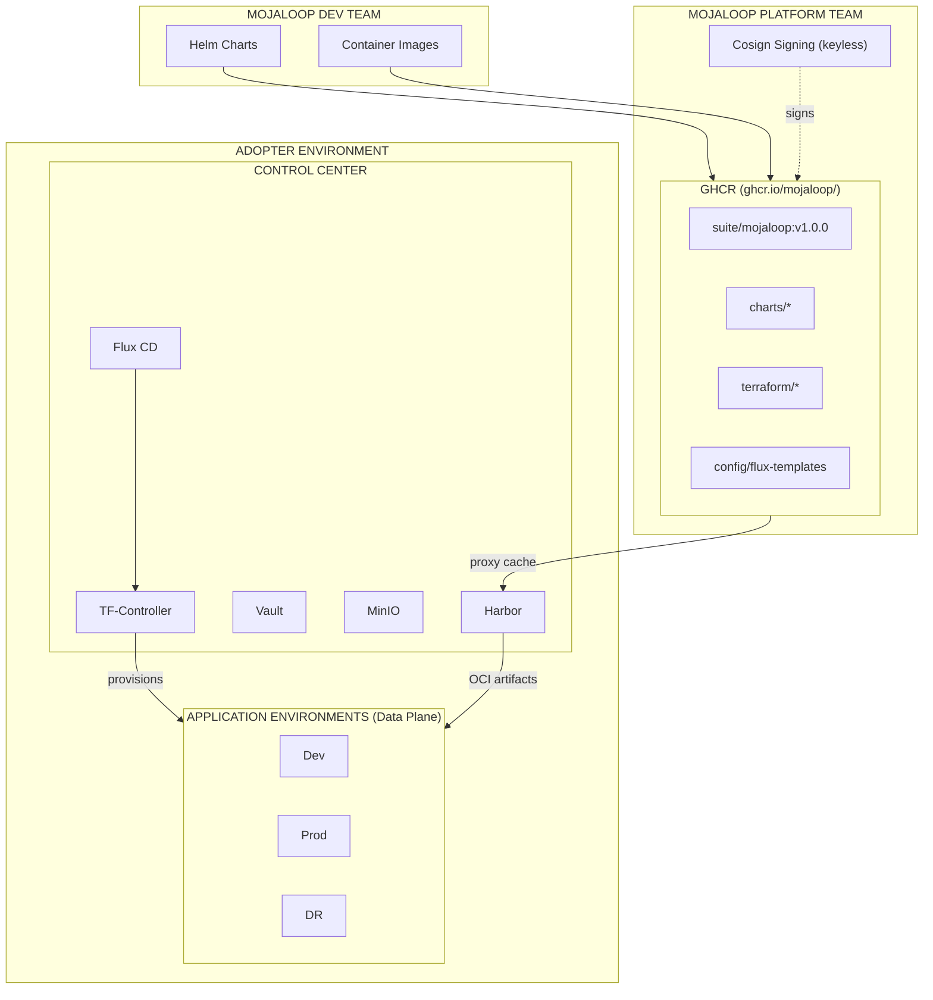

### 2.2 Key Architectural Principles

1. **The Cluster is Deaf to Git:** No cluster (Control Center or Application Environment) connects to any Git server. All clusters communicate only with OCI registries (Harbor).

2. **OCI is the Universal Source of Truth:** Both infrastructure configuration (for the Control Center) and application configuration (for App Environments) are distributed as OCI artifacts. Git may be used by humans for version control, but clusters never see it.

3. **The Control Center is Generic, Then Customized:** The Control Center is initially deployed as a generic, unconfigured factory. Adopters customize it by pushing configuration artifacts (defining their environments) to Harbor.

4. **Infrastructure as Custom Resources:** Application Environments are defined as Kubernetes Custom Resources (e.g., `AppEnvironment`). The Control Center's Flux and TF-Controller watch these resources and provision infrastructure accordingly.

5. **Vendor Artifacts are Immutable:** The Vendor publishes versioned, signed artifacts. Adopters pin to specific versions and upgrade deliberately.

6. **Provider Abstraction:** Infrastructure provisioning is abstracted behind provider-specific Terraform modules. Adding a new cloud/infrastructure provider requires only adding a new module, not changing the core architecture.

### 2.3 Data Flow Summary

| Stage | Source | Destination | Mechanism |
|-------|--------|-------------|-----------|
| Vendor Publish | Vendor CI/CD | Vendor OCI Registry | `flux push artifact` / `helm push` |
| CC Mirror | Vendor OCI Registry | Control Center Harbor | Harbor Proxy Cache |
| CC Bootstrap | Adopter Workstation | Control Center | Terraform (one-time) |
| CC Config | Adopter Workstation | Control Center (local file) | Terraform reads local config.yaml |
| Infra Provision | Control Center Flux | Infrastructure Provider | TF-Controller (Terraform) |
| App Env Bootstrap | Control Center | App Environment Cluster | Flux + Vault |
| App Env Sync | Control Center Harbor | App Environment Flux | Flux `OCIRepository` |

### 2.4 Infrastructure Provider Strategy

The architecture is designed to be **infrastructure-agnostic**. The current implementation targets **Proxmox VE** as the primary infrastructure provider, but the design allows for easy addition of new providers.

| Provider | Status | Notes |
|----------|--------|-------|
| **Proxmox VE** | Active | Primary target for on-premises deployments. |
| AWS | Planned | Will use EKS, S3, and managed services where available. |
| Azure | Planned | Will use AKS, Azure Blob, and managed services. |
| GCP | Planned | Will use GKE, GCS, and managed services. |
| Bare Metal | Planned | Direct Talos deployment on physical servers. |

**Design Principles for Provider Support:**

1. **Favor Managed Services:** When deploying to cloud providers, prefer managed services (e.g., managed Kubernetes, managed databases, managed object storage) over self-hosted equivalents to reduce operational burden.

2. **Provider-Specific Modules:** Each provider has its own Terraform module that implements a standard interface. The Control Center's TF-Controller invokes the appropriate module based on the `AppEnvironment` specification.

3. **Minimal Effort to Add Providers:** Adding a new provider requires:
   - A new Terraform module implementing the standard interface.
   - Provider-specific credentials configuration in Vault.
   - No changes to the Control Center's core orchestration logic.

---

## 3. Roles and Responsibilities

This architecture involves three distinct teams with clear boundaries:

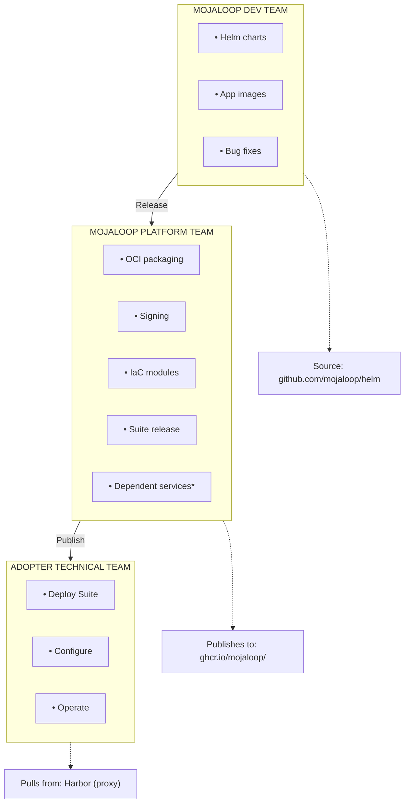

> **\*** Dependent services: Vault, Cert-manager, Istio (mTLS), External DNS, Cilium (CNI/mesh), OpenEBS, Database Operators (Strimzi, Percona, etc.)

### 3.1 Mojaloop Dev Team

The Dev Team is responsible for developing and maintaining the application Helm charts and container images.

**Responsibilities:**

| Responsibility | Deliverable | Published To |
|----------------|-------------|--------------|
| Helm Chart Development | Subchart packages (mojaloop-core, mojaloop-backend, mcm, bof) | GitHub Releases |
| Container Images | Application container images | `ghcr.io/mojaloop/images/` |
| Chart Testing | Helm lint, template validation, unit tests | CI/CD pipelines |
| Documentation | Chart README, values.yaml documentation | GitHub repository |

**Activities:**

1. **Develop** Helm chart templates and application code
2. **Test** charts in development/staging environments
3. **Version** charts using semantic versioning (semver)
4. **Release** charts via GitHub releases (e.g., `mojaloop-core-v2.0.0`)
5. **Publish** container images to GHCR
6. **Coordinate** with Platform Team on release readiness

**Dev Team Does NOT:**
- Package charts as OCI artifacts (Platform Team does this)
- Manage Terraform/IaC modules
- Define infrastructure requirements
- Have access to adopter environments

**Source Repository:** [github.com/mojaloop/helm](https://github.com/mojaloop/helm)

---

### 3.2 Mojaloop Platform Team

The Platform Team is responsible for packaging, signing, testing, and releasing the **Mojaloop Suite**. They maintain all infrastructure-as-code modules and **dependent services** required to run Mojaloop in production.

**Responsibilities:**

| Responsibility | Deliverable | Published To |
|----------------|-------------|--------------|
| Suite Packaging | Versioned Mojaloop Suite releases | `ghcr.io/mojaloop/suite/` |
| OCI Packaging | Helm charts as signed OCI artifacts | `ghcr.io/mojaloop/charts/` |
| Dependent Services | Helm charts/configs for production dependencies (see below) | `ghcr.io/mojaloop/charts/` |
| Terraform Modules | Cluster provisioning, provider modules | `ghcr.io/mojaloop/terraform/` |
| Flux Templates | Base configuration for all Flux layers | `ghcr.io/mojaloop/config/` |
| Artifact Signing | Cosign signatures (keyless/Sigstore) | Attached to all OCI artifacts |
| Integration Testing | End-to-end deployment testing | Reference environments |
| Release Management | Suite releases, changelogs, upgrade guides | GitHub + GHCR |

**Dependent Services:**

The Mojaloop application (maintained by Dev Team) requires additional services to run in a production environment. The Platform Team is responsible for selecting, configuring, testing, and packaging these dependencies as part of the Suite:

| Layer | Dependent Service | Purpose |
|-------|-------------------|---------|
| **Platform** | Vault | Secrets management, PKI, encryption |
| **Platform** | Cert-manager | TLS certificate automation |
| **Platform** | External Secrets Operator | Sync secrets from Vault to K8s |
| **Platform** | Cilium | CNI, network policies, load balancing |
| **Platform** | Istio | mTLS for external service communication |
| **Platform** | OpenEBS | Storage provisioning (Category A) |
| **Platform** | Gateway API | Ingress and traffic management |
| **Networking** | External DNS | Automatic DNS record management |
| **Networking** | Let's Encrypt Issuers | Production TLS certificates |
| **Observability** | Grafana, Loki, Tempo, Mimir (CC only); Collectors (App Envs) | Monitoring, logging, tracing |
| **Data Layer** | Strimzi Operator | Kafka cluster management |
| **Data Layer** | Percona Operator | MySQL cluster management |
| **Data Layer** | MongoDB Operator | MongoDB cluster management |
| **Data Layer** | Redis Operator | Redis cluster management |

These services are **not** part of the Mojaloop Helm chart (maintained by Dev Team) but are **essential** for production deployments. The Platform Team:
- Selects appropriate versions of each dependency
- Configures them for Mojaloop compatibility
- Tests them together as part of the Suite
- Packages their configurations in the Flux templates

**Activities:**

1. **Pull** Helm charts from Dev Team's GitHub releases
2. **Package** charts as OCI artifacts and push to GHCR
3. **Sign** all artifacts with Cosign (keyless/Sigstore)
4. **Develop** and maintain Terraform modules for all providers
5. **Develop** and maintain Flux configuration templates (including dependent services)
6. **Select and configure** dependent services for each Suite release
7. **Test** full deployment lifecycle on reference infrastructure
8. **Bundle** tested versions into Mojaloop Suite releases
9. **Publish** Suite releases with documentation

**Platform Team Does NOT:**
- Develop application business logic
- Manage adopter environments
- Store or access adopter secrets
- Modify application Helm chart logic (only packaging)

---

### 3.3 Adopter Technical Team

The Adopter Technical Team deploys and operates the Mojaloop Suite in their own infrastructure.

**Responsibilities:**

| Responsibility | Deliverable | Location |
|----------------|-------------|----------|
| Infrastructure | VMs, networks, storage, or cloud resources | Adopter's cloud/on-prem |
| Control Center | Running CC cluster with Harbor, Vault, observability | Adopter infrastructure |
| Environment Config | AppEnvironment definitions (dev, prod, dr) | Harbor (OCI artifacts) |
| Secrets | Database passwords, API keys, certificates | Vault |
| Operations | Monitoring, troubleshooting, scaling, DR | Adopter responsibility |

**Activities:**

1. **Select** a Mojaloop Suite version to deploy
2. **Bootstrap** Control Center using Platform Team's Terraform modules
3. **Configure** Harbor to proxy GHCR (caches all vendor artifacts)
4. **Define** AppEnvironment CRs for their environments
5. **Verify** artifact signatures before deployment
6. **Customize** Flux configuration using `postBuild` substitution
7. **Monitor** environments using centralized observability
8. **Upgrade** to new Suite versions as released

**Adopter Does NOT:**
- Modify vendor Helm charts directly (use values overrides)
- Build application container images
- Require direct internet access from clusters (Harbor proxies everything)
- Manage individual component versions (Suite handles this)

---

## 4. Artifact Lifecycle

This section describes how artifacts flow from development to production, and how the Mojaloop Suite is packaged and distributed.

### 4.1 Artifact Flow Overview

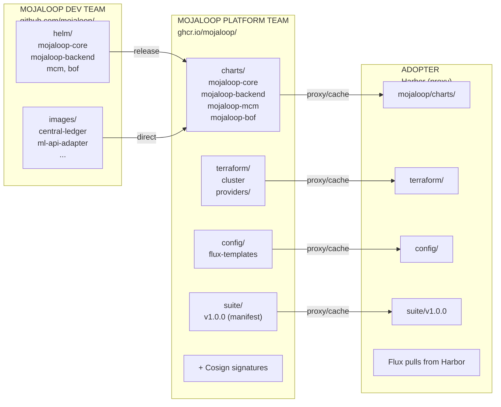

### 4.2 Mojaloop Suite Model

The **Mojaloop Suite** is a versioned distribution that bundles all components needed to deploy Mojaloop. Adopters reference a single Suite version rather than managing individual component versions.

**Why a Suite Model?**

| Aspect | Without Suite | With Suite |
|--------|---------------|------------|
| **Version Management** | Adopter tracks 4+ chart versions + TF modules | Adopter tracks one Suite version |
| **Compatibility** | Adopter must verify component compatibility | Platform Team guarantees compatibility |
| **Upgrades** | Complex multi-component coordination | Single version bump |
| **Support** | "Which versions are you running?" | "Which Suite version?" |

**Suite Versioning:** Semantic versioning (semver) - `v1.0.0`, `v1.1.0`, `v2.0.0`

- **Major** (`v2.0.0`): Breaking changes, may require migration
- **Minor** (`v1.1.0`): New features, backward compatible
- **Patch** (`v1.0.1`): Bug fixes, security patches

### 4.3 GHCR Registry Structure

All artifacts are published to GitHub Container Registry under the `mojaloop` organization:

```
ghcr.io/mojaloop/
│
├── suite/                              # Suite manifests (Platform Team)
│   ├── mojaloop:v1.0.0                 # Suite v1.0.0 manifest
│   ├── mojaloop:v1.1.0                 # Suite v1.1.0 manifest
│   └── mojaloop:latest                 # Latest stable Suite
│
├── charts/                             # Helm charts as OCI (Platform Team)
│   ├── mojaloop-core:v2.0.0            # Core switch services
│   ├── mojaloop-backend:v1.0.0         # Data layer configurations
│   ├── mojaloop-mcm:v1.5.0             # Connection Manager
│   └── mojaloop-bof:v1.2.0             # Business Operations Framework
│
├── terraform/                          # Terraform modules as OCI (Platform Team)
│   ├── cluster:v1.0.0                  # Unified cluster provisioning
│   └── providers/
│       ├── proxmox:v1.0.0              # Proxmox provider module
│       ├── aws:v1.0.0                  # AWS provider module
│       └── ...
│
├── config/                             # Configuration templates (Platform Team)
│   └── flux-templates:v1.0.0           # Base Flux layer configurations
│
└── images/                             # Container images (Dev Team)
    ├── central-ledger:v17.0.0
    ├── ml-api-adapter:v14.0.0
    ├── quoting-service:v15.0.0
    └── ...
```

### 4.4 Suite Manifest

Each Suite version is defined by a manifest that pins all component versions:

```yaml
# ghcr.io/mojaloop/suite/mojaloop:v1.0.0
apiVersion: mojaloop.io/v1
kind: SuiteManifest
metadata:
  name: mojaloop-suite
  version: "v1.0.0"
  releaseDate: "2026-01-15"
spec:
  # Helm charts included in this Suite
  charts:
    mojaloop-core:
      repository: oci://ghcr.io/mojaloop/charts
      version: "2.0.0"
    mojaloop-backend:
      repository: oci://ghcr.io/mojaloop/charts
      version: "1.0.0"
    mojaloop-mcm:
      repository: oci://ghcr.io/mojaloop/charts
      version: "1.5.0"
    mojaloop-bof:
      repository: oci://ghcr.io/mojaloop/charts
      version: "1.2.0"
  
  # Terraform modules
  terraform:
    cluster:
      repository: oci://ghcr.io/mojaloop/terraform
      version: "1.0.0"
  
  # Flux configuration templates
  fluxTemplates:
    repository: oci://ghcr.io/mojaloop/config/flux-templates
    version: "1.0.0"
  
  # Minimum requirements
  requirements:
    kubernetes: ">=1.29"
    talos: ">=1.6"
    flux: ">=2.2"
  
  # Supported infrastructure providers
  providers:
    - name: proxmox
      status: stable
    - name: aws
      status: planned
    - name: gcp
      status: beta
    - name: azure
      status: planned
  
  # Upgrade compatibility
  upgradesFrom:
    - "v0.9.0"
  
  # Release information
  releaseNotes: |
    ## Mojaloop Suite v1.0.0
    
    ### Highlights
    - Initial stable release
    - Full support for Proxmox provider
    
    ### Components
    - mojaloop-core v2.0.0: New settlement engine
    - mojaloop-mcm v1.5.0: Improved DFSP onboarding flow
    
    ### Breaking Changes
    - None (initial release)
```

### 4.5 Helm Chart Publishing Workflow

#### Step 1: Dev Team Creates Release

```bash
# Dev Team tags a new chart version
cd helm/charts/mojaloop-core
# Update Chart.yaml version to 2.0.0
git tag mojaloop-core-v2.0.0
git push origin mojaloop-core-v2.0.0

# GitHub Actions builds and publishes container images
# Images pushed to ghcr.io/mojaloop/images/
```

#### Step 2: Platform Team Packages as OCI

```bash
# Platform Team CI/CD triggered by Dev release

# 1. Pull chart from GitHub release
helm pull oci://ghcr.io/mojaloop/charts/mojaloop-core --version 2.0.0 \
  --untar --untardir ./staging/

# 2. Package as OCI artifact
helm package ./staging/mojaloop-core -d ./dist/

# 3. Push to GHCR
helm push ./dist/mojaloop-core-2.0.0.tgz oci://ghcr.io/mojaloop/charts

# 4. Sign with Cosign (keyless)
cosign sign ghcr.io/mojaloop/charts/mojaloop-core:2.0.0
```

#### Step 3: Platform Team Creates Suite Release

```bash
# After all components are tested together

# 1. Create Suite manifest (suite-v1.0.0.yaml)
# 2. Push manifest as OCI artifact
flux push artifact oci://ghcr.io/mojaloop/suite/mojaloop:v1.0.0 \
  --path=./suite-v1.0.0.yaml \
  --source="$(git config --get remote.origin.url)" \
  --revision="v1.0.0"

# 3. Sign Suite manifest
cosign sign ghcr.io/mojaloop/suite/mojaloop:v1.0.0

# 4. Update latest tag
crane tag ghcr.io/mojaloop/suite/mojaloop:v1.0.0 latest
```

### 4.6 Artifact Signing with Cosign (Keyless)

All OCI artifacts are signed using Cosign with Sigstore keyless signing, providing:

- **Provenance**: Signature proves artifact originated from Mojaloop GitHub Actions
- **Integrity**: Any tampering invalidates the signature
- **Transparency**: All signatures recorded in Rekor public transparency log
- **No Key Management**: No private keys to protect or rotate

**How Keyless Signing Works:**

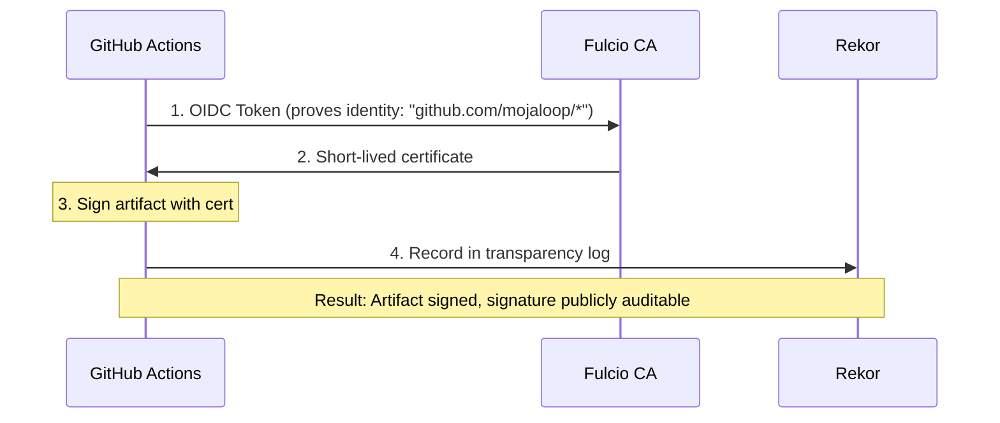

**Signing (Platform Team CI/CD):**

```bash
# Automatic in GitHub Actions - uses OIDC token, no keys needed
cosign sign ghcr.io/mojaloop/charts/mojaloop-core:2.0.0
```

**Verification (Adopter - Manual):**

```bash
# Verify artifact came from Mojaloop GitHub Actions
cosign verify ghcr.io/mojaloop/charts/mojaloop-core:2.0.0 \
  --certificate-identity-regexp="https://github.com/mojaloop/*" \
  --certificate-oidc-issuer="https://token.actions.githubusercontent.com"
```

**Verification (Adopter - Automated via Flux):**

```yaml
apiVersion: source.toolkit.fluxcd.io/v1
kind: HelmRepository
metadata:
  name: mojaloop
  namespace: flux-system
spec:
  type: oci
  url: oci://ghcr.io/mojaloop/charts
  interval: 10m
  verify:
    provider: cosign
    matchOIDCIdentity:
      - issuer: "https://token.actions.githubusercontent.com"
        subject: "https://github.com/mojaloop/*"
```

Flux will refuse to deploy any artifact that fails signature verification.

### 4.7 Adopter Workflow: Using a Suite Version

Adopters reference a Suite version in their AppEnvironment CR:

```yaml
apiVersion: mojaloop.io/v1alpha1
kind: AppEnvironment
metadata:
  name: production
  namespace: environments
spec:
  suite: "v1.0.0"              # Mojaloop Suite version - that's it!
  provider: proxmox
  cluster:
    name: ml-prod
    controlPlane:
      nodes: 3
    workers:
      nodes: 5
  # Optional: Override specific values (advanced)
  # values:
  #   mojaloop-core:
  #     replicas: 5
```

The Platform Team's Flux templates automatically:
1. Read the Suite manifest for `v1.0.0`
2. Deploy each chart at the pinned version
3. Apply the appropriate Flux layer configuration
4. Verify all signatures before deployment

**Checking for Updates:**

```bash
# List available Suite versions
crane ls ghcr.io/mojaloop/suite/mojaloop

# View Suite release notes
flux pull artifact oci://ghcr.io/mojaloop/suite/mojaloop:v1.1.0 --output=- | yq '.spec.releaseNotes'
```

---

## 5. Component Deep Dive

### 5.1 FluxCD

FluxCD is the GitOps engine that runs inside the Kubernetes cluster. In this architecture, it is configured to operate in **"Gitless"** mode.

**Key Resources Used:**

| Resource | Purpose |
|----------|---------|
| `OCIRepository` | Tells Flux to watch an OCI artifact in Harbor for changes. |
| `Kustomization` | Tells Flux how to apply the manifests found in the `OCIRepository`. |
| `HelmRelease` | Tells Flux to install/upgrade a Helm chart from an OCI source. |

**Why FluxCD over ArgoCD?**

| Criteria | FluxCD | ArgoCD |
|----------|--------|--------|
| UI Dependency | Headless (No UI). Your Control Center is the UI. | Ships with a dominant Web UI. |
| Architecture | Decentralized agents. Runs independently per cluster. | Centralized management plane. |
| OCI Support | Native, first-class support since 2022. GA in v2.6 (2025). | Requires plugins or workarounds. |
| Vendor Embedding | Designed to be embedded invisibly. | Designed to be a user-facing platform. |

### 5.2 Harbor

Harbor is the adopter's local OCI registry. It serves three critical functions:

1. **Proxy Cache:** Mirrors Vendor artifacts on first pull, reducing external network dependency.
2. **Config Storage:** Stores the adopter's configuration artifacts (the "Gitless" source of truth).
3. **Private Image Host:** Stores any private container images the adopter may have.

**Minimum Harbor Configuration:**

| Feature | Requirement |
|---------|-------------|
| Projects | `vendor-cache` (Proxy), `env-config` (Local), `private-images` (Local) |
| Robot Accounts | One for Flux to pull artifacts. |
| Replication Rules | (Optional) If not using Proxy Cache, configure pull-based replication from Vendor Registry. |

**Configuration Artifact Types:**

| Project | Purpose | Contents |
|---------|---------|----------|
| `env-config` | Master Inventory | `AppEnvironment` CRs that define all environments (dev, prod, dr) in a single OCI artifact. Pushed by adopters to trigger TF-Controller provisioning. |

**Note:** Use `harbor.internal` for all in-cluster references (Flux sources, image pulls). External URLs (e.g., `harbor.cc.example.com`) are only used for workstation access when pushing artifacts.

### 5.3 OpenTofu / Terraform

OpenTofu (or Terraform) is used for provisioning the underlying infrastructure (VMs, networks, storage) **before** Kubernetes and Flux exist.

**Key Capability (2025+):** OpenTofu natively supports sourcing modules from OCI registries:

```hcl
module "talos_cluster" {
  source  = "oci://vendor-registry.io/infra-modules/talos-cluster:v1.0.0"
  
  # Adopter-specific variables
  cluster_name = var.cluster_name
  node_count   = var.node_count
}
```

This allows the Vendor to distribute Terraform modules as versioned OCI artifacts, ensuring the adopter always uses compatible infrastructure code.

#### 5.3.1 Configuration Approach: YAML over HCL

Terraform configuration uses **YAML files** instead of traditional `terraform.tfvars` or HCL variable files. This design decision provides several benefits:

```yaml
# config/config.yaml - Adopter configuration
provider: proxmox

deployment_template: small  # References a predefined template

network:
  vip: 192.168.88.12
  dmz-cidr: 192.168.101.0/24
  internal-cidr: 192.168.88.0/24

vm-placement-mapping:
  regions:
    region-1:
      provider_value: pr-site
      zones:
        zone-1:
          provider_value: ml-test
          placement-groups:
            placement-group-1:
              provider_value: node0
```

**Why YAML instead of tfvars?**

| Aspect | YAML Config | terraform.tfvars |
|--------|-------------|------------------|
| **Readability** | Human-friendly, supports comments and nesting | HCL syntax, less familiar to non-Terraform users |
| **Portability** | Works with TF-Controller, scripts, and other tools | Terraform-specific |
| **Validation** | Can be validated with JSON Schema | Limited validation |
| **Templating** | Supports deployment templates and inheritance | Flat variable structure |
| **Abstraction** | Provider-agnostic (e.g., `instance_type: co-4vcpu-8gb`) | Often provider-specific |

The `config-loader` module reads YAML configuration and transforms it into the appropriate Terraform variables, including provider-specific mappings.

#### 5.3.2 Why Not Terragrunt?

[Terragrunt](https://terragrunt.gruntwork.io/) is a popular wrapper for Terraform that provides DRY configuration, dependency management, and multi-environment orchestration. However, it is **not used** in this architecture for the following reasons:

| Terragrunt Feature | Our Solution | Rationale |
|-------------------|--------------|-----------|
| **DRY backend config** | Single backend, MinIO for state | No multi-account complexity |
| **DRY provider config** | Single `providers.tf` at root | Provider selected by YAML config |
| **Module composition** | Native Terraform module calls | Simpler, no wrapper overhead |
| **Multi-environment** | YAML `deployment_template` + TF-Controller | Environments are K8s CRs, not directories |
| **Variable inheritance** | `config-loader` module | YAML hierarchy more intuitive |
| **Run-all commands** | Not needed | Single entry point; TF-Controller for App Envs |

**Key insight:** Terragrunt excels when you have many independent Terraform root modules across multiple AWS accounts/regions. Our architecture has:
- A single root module for Control Center bootstrap
- App Environments provisioned by TF-Controller (not human-run Terraform)
- Configuration variance handled by YAML, not directory structure

Adding Terragrunt would introduce complexity without solving problems we have.

#### 5.3.3 Terraform Module Structure

The Terraform codebase is organized into reusable modules that support multiple infrastructure providers while maintaining DRY principles.

**Module Architecture:**

```
src/
├── main.tf                              # Entry point - orchestrates modules
├── providers.tf                         # Provider configurations
├── variables.tf                         # Root variables (minimal - config is YAML)
├── outputs.tf                           # Root outputs
│
├── modules/
│   ├── config-loader/                   # YAML configuration parsing
│   │   ├── main.tf                      # Loads and transforms YAML config
│   │   ├── variables.tf                 # Config file paths
│   │   └── outputs.tf                   # Parsed config objects
│   │
│   ├── cluster/                         # Unified cluster provisioning interface
│   │   ├── main.tf                      # Dispatches to provider, bootstraps Flux
│   │   ├── variables.tf                 # Common inputs (provider-agnostic)
│   │   └── outputs.tf                   # kubeconfig, endpoint, node IPs
│   │
│   ├── providers/                       # Provider-specific implementations
│   │   │
│   │   ├── talos-base/                  # Shared Talos logic (Category A providers)
│   │   │   ├── main.tf                  # talos-gen-config + talos-bootstrap
│   │   │   ├── variables.tf
│   │   │   └── outputs.tf
│   │   │
│   │   ├── proxmox/                     # Proxmox VE (Category A)
│   │   │   ├── main.tf                  # Creates VMs, calls talos-base
│   │   │   ├── vm.tf                    # VM resource definitions
│   │   │   ├── cloudinit.tf             # Cloud-init configuration
│   │   │   ├── images.tf                # OS image management
│   │   │   └── mappings/                # Provider-specific type mappings
│   │   │
│   │   ├── harvester/                   # Harvester HCI (Category A)
│   │   │   ├── main.tf                  # Creates VMs, calls talos-base
│   │   │   └── ...
│   │   │
│   │   ├── aws/                         # AWS (Category B - Managed)
│   │   │   ├── main.tf                  # Creates EKS, S3, etc.
│   │   │   ├── eks.tf                   # EKS cluster configuration
│   │   │   ├── vpc.tf                   # VPC and networking
│   │   │   └── storage.tf               # S3 buckets for Harbor/Vault
│   │   │
│   │   ├── gcp/                         # GCP (Category B - Managed)
│   │   │   ├── main.tf                  # Creates GKE, GCS, etc.
│   │   │   └── ...
│   │   │
│   │   └── azure/                       # Azure (Category B - Managed)
│   │       ├── main.tf                  # Creates AKS, Blob, etc.
│   │       └── ...
│   │
│   ├── talos-gen-config/                # Talos configuration generator
│   │   ├── main.tf                      # Generates machine configs
│   │   ├── variables.tf
│   │   └── outputs.tf
│   │
│   ├── talos-bootstrap/                 # Talos cluster bootstrapper
│   │   ├── main.tf                      # Bootstraps etcd, generates kubeconfig
│   │   ├── variables.tf
│   │   └── outputs.tf
│   │
│   ├── fluxcd-bootstrap/                # Flux installation
│   │   ├── main.tf                      # Installs Flux, configures source
│   │   ├── variables.tf                 # Supports Git and OCI sources
│   │   └── outputs.tf
│   │
│   └── ssh-keys/                        # SSH key generation
│       └── ...
│
└── configs/                             # Platform engineer configs
    ├── config.yaml                      # Platform defaults (K8s/Talos versions)
    ├── deployment-templates.yaml        # Instance templates (tiny, small, ha)
    ├── instance-types.yaml              # Abstract instance type definitions
    ├── storage-types.yaml               # Abstract storage class definitions
    └── workload-classes.yaml            # Workload class definitions
```

**Provider Categories:**

Infrastructure providers fall into two categories with different provisioning patterns:

| Category | Providers | Kubernetes | Data Layer | Talos |
|----------|-----------|------------|------------|-------|
| **A: Self-Managed** | Proxmox, Harvester, Bare Metal, OpenStack | Talos Linux | Self-hosted (MinIO, etc.) | Yes |
| **B: Cloud-Managed** | AWS, GCP, Azure | EKS/GKE/AKS | Managed services (S3, GCS, etc.) | No |

**Category A Flow (e.g., Proxmox):**

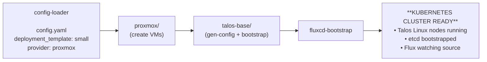

**Category B Flow (e.g., AWS):**

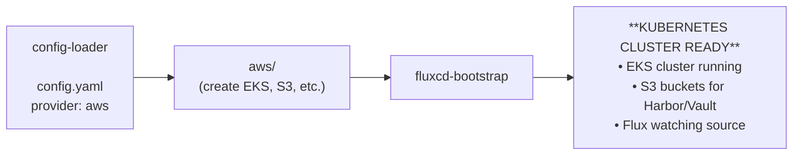

**Key Design Principles:**

1. **Provider Abstraction:** The `cluster/` module provides a unified interface. Callers don't need to know if it's Talos or EKS underneath.

2. **Shared Talos Logic:** Category A providers share `talos-base/` module, avoiding duplication of Talos config generation and bootstrap logic.

3. **Config-Driven:** All variance is in YAML configuration, not in module code. Adding a new deployment size means editing `deployment-templates.yaml`, not Terraform.

4. **Terraform for Infra Only:** Terraform provisions infrastructure and installs Flux. All Kubernetes resources (Harbor, Vault, applications) are managed by Flux via HelmReleases.

5. **Separation of Concerns:**

   | Layer | Managed By | Examples |
   |-------|-----------|----------|
   | Infrastructure | Terraform | VMs, EKS clusters, S3 buckets, VPCs |
   | Kubernetes Bootstrap | Terraform | Flux installation, initial source config |
   | Kubernetes Resources | Flux | Harbor, Vault, MinIO, TF-Controller, Apps |

**Module Interface Contract:**

All provider modules must expose these outputs for the `cluster/` module to consume:

```hcl
# Required outputs from any provider module
output "kubeconfig" {
  description = "Kubeconfig for accessing the cluster"
  value       = <provider-specific>
  sensitive   = true
}

output "cluster_endpoint" {
  description = "Kubernetes API endpoint"
  value       = <provider-specific>
}

output "cluster_ca_certificate" {
  description = "Cluster CA certificate (base64)"
  value       = <provider-specific>
  sensitive   = true
}
```

This allows the `fluxcd-bootstrap` module to work identically regardless of the underlying provider.

#### 5.3.4 Configuration Separation: Infrastructure vs Applications

The architecture maintains a clear separation between **User Configuration** (what the adopter defines) and **Vendor Templates** (what Flux deploys), bridged by runtime injection.

**Configuration Model:**

| Layer | What | Where | Processor |
|-------|------|-------|-----------|
| **User Config (CC)** | `config.yaml` for Control Center | Adopter's workstation (local file) | Terraform (`tofu apply`) |
| **User Config (App Envs)** | `dev.yaml`, `prod.yaml`, etc. | Harbor: `env-config` OCI artifact (Inventory) | TF-Controller on CC |
| **Vendor Templates** | Generic Flux manifests with `${VAR}` placeholders | GHCR: `flux-templates` OCI artifact | Flux Controller |
| **Runtime Bridge** | `cluster-vars` ConfigMap | Injected directly into each cluster by Terraform | Flux `substituteFrom` |

**The Flow:**

```
┌─────────────────────────────────────────────────────────────────────────────┐
│                     USER CONFIG (One file per environment)                   │
│                                                                              │
│  Control Center:                                                             │
│    config/config.yaml         # Lives on adopter's workstation               │
│                                                                              │
│  App Environments (Inventory in Harbor):                                     │
│    environments/                                                             │
│    ├── dev.yaml               # Each file = one environment definition       │
│    ├── prod.yaml                                                             │
│    └── kustomization.yaml     # Inventory list                               │
│                                                                              │
│  Pushed to: oci://harbor.internal/config/env-config:v1.0.0                   │
│                                                                              │
└───────────────────────────┬─────────────────────────────────────────────────┘
                            │
                            │ Terraform reads config, provisions infra,
                            │ and INJECTS cluster-vars directly into cluster
                            ▼
┌─────────────────────────────────────────────────────────────────────────────┐
│                     RUNTIME STATE (Inside each cluster)                      │
│                                                                              │
│  ConfigMap: cluster-vars      # Created by Terraform, NOT stored in Harbor   │
│    CLUSTER_NAME: "ml-prod"                                                   │
│    DOMAIN: "prod.mojaloop.io"                                                │
│    VIP: "192.168.88.14"       # Computed by cloud provider                   │
│    HARBOR_URL: "harbor.internal"                                             │
│                                                                              │
└───────────────────────────┬─────────────────────────────────────────────────┘
                            │
                            │ Flux reads ConfigMap for variable substitution
                            ▼
┌─────────────────────────────────────────────────────────────────────────────┐
│                     VENDOR TEMPLATES (Generic, reusable)                     │
│                                                                              │
│  OCI Artifact: ghcr.io/mojaloop/config/flux-templates:v1.0.0                 │
│                                                                              │
│  Contents:                                                                   │
│    platform.yaml      # HelmReleases for Cilium, Vault, etc.                 │
│    networking.yaml    # Cert-manager, External DNS, Gateway                  │
│    apps.yaml          # Mojaloop HelmRelease with ${DOMAIN}, ${VIP}          │
│                                                                              │
│  All Kustomizations use:                                                     │
│    postBuild:                                                                │
│      substituteFrom:                                                         │
│        - kind: ConfigMap                                                     │
│          name: cluster-vars                                                  │
│                                                                              │
└─────────────────────────────────────────────────────────────────────────────┘
```

**Key Points:**

1. **One config file per environment:** CC has its own `config.yaml`. Each App Env has its own file (`dev.yaml`, `prod.yaml`).
2. **CC config stays local:** The Control Center's `config.yaml` lives on the adopter's workstation (with secure backup). It is never pushed to Harbor.
3. **App Env configs go to Harbor:** App Environment definitions are pushed to Harbor as an "Inventory" artifact (`env-config`). Adding a new environment = adding a file to this inventory and pushing.
4. **`cluster-vars` is injected, not stored:** Terraform creates the `cluster-vars` ConfigMap directly in the target cluster's Kubernetes API. It is NOT stored in Harbor. This keeps computed values (like IPs) ephemeral and tied to the cluster lifecycle.
5. **Vendor templates are generic:** The Flux templates from the Platform Team contain no environment-specific data. They use `${VARIABLE}` placeholders that Flux substitutes at runtime from the injected ConfigMap.

**Flux Application Layers:**

Each environment's Flux configuration is organized into dependent layers, deployed in order:

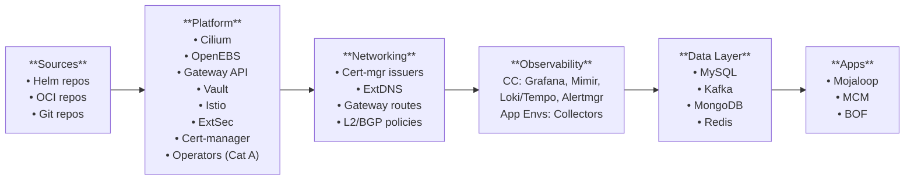

**Dependencies:**
- **Sources**: None
- **Platform**: Sources
- **Networking**: Platform
- **Observability**: Networking
- **Data Layer**: Observability + Operators
- **Apps**: Data Layer (App Envs) or Networking (CC)

**Layer Details:**

| Layer | Kustomization | Contents | Depends On |
|-------|---------------|----------|------------|
| **Sources** | `sources.yaml` | HelmRepository, OCIRepository, GitRepository definitions | None |
| **Platform** | `platform.yaml` | CNI (Cilium), storage (OpenEBS), Gateway API CRDs, Vault, Istio, External Secrets Operator, Cert-manager (operator). For **Category A only**: database/MQ operators (Strimzi, Percona, MongoDB, Redis) | Sources |
| **Networking** | `networking.yaml` | Cert-manager issuers/certificates, External DNS config, Gateway instances and HTTPRoutes, Cilium L2/BGP policies, Network policies | Platform |
| **Observability** | `observability.yaml` | **CC only**: Full monitoring stack (Grafana, Mimir/Thanos, Loki, Tempo, Alertmanager). **App Envs**: Collectors only (Prometheus agent, Promtail, OTel Collector) that ship telemetry to CC | Networking |
| **Data Layer** | `data-layer.yaml` | Database and message queue **instances**. For **Category A**: Operator-managed (Percona MySQL, Strimzi Kafka, MongoDB, Redis). For **Category B**: Managed services (RDS, MSK, DocumentDB, ElastiCache) provisioned by TF-Controller on CC | Observability + Operators |
| **Apps** | `apps.yaml` | Applications: Mojaloop, MCM, BOF (for App Envs) or Harbor, Gitea, TF-Controller (for CC) | Data Layer (App Envs) or Networking (CC) |

**Provider Category Differences:**

| Layer | Category A (Self-Managed) | Category B (Cloud-Managed) |
|-------|---------------------------|----------------------------|
| **Platform** | Includes DB/MQ operators (Strimzi, Percona, etc.) | No operators needed |
| **Data Layer** | Operator CRs (PerconaXtraDBCluster, Kafka, etc.) | TF-Controller on CC provisions managed services (RDS, MSK, etc.) |
| **Observability** | Collectors only; ship to CC | Collectors only; ship to CC (or optionally to managed services like CloudWatch) |

**Observability Architecture:**

The Control Center hosts the centralized observability stack. App Environments run lightweight agents that ship telemetry to the CC:

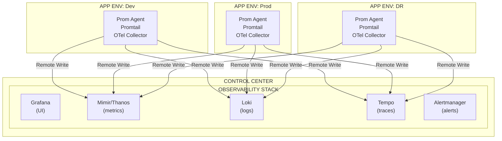

**Note:** The Control Center does not have a Data Layer - it runs Harbor, MinIO, and Vault directly. App Environments have the full 6-layer stack.

**Post-Build Variable Substitution:**

Flux Kustomizations (from Vendor's `flux-templates`) use `postBuild.substituteFrom` to inject environment-specific values:

```yaml
# Example from Vendor's flux-templates OCI artifact (platform.yaml)
apiVersion: kustomize.toolkit.fluxcd.io/v1
kind: Kustomization
metadata:
  name: platform
  namespace: flux-system
spec:
  interval: 10m
  sourceRef:
    kind: OCIRepository
    name: flux-templates      # Points to Vendor's generic templates
  path: ./platform            # Generic platform layer manifests
  prune: true
  postBuild:
    substituteFrom:
      - kind: ConfigMap
        name: cluster-vars    # Injected by Terraform, NOT stored in Harbor
      - kind: Secret
        name: cluster-secrets # From Vault via External Secrets Operator
```

**OCIRepository Definitions:**

```yaml
# Vendor Templates (generic, reusable across all environments)
apiVersion: source.toolkit.fluxcd.io/v1beta2
kind: OCIRepository
metadata:
  name: flux-templates
  namespace: flux-system
spec:
  interval: 1h
  url: oci://harbor.internal/vendor-cache/flux-templates
  ref:
    tag: "v1.0.0"             # Suite version
---
# Master Inventory (adopter's environment definitions)
apiVersion: source.toolkit.fluxcd.io/v1beta2
kind: OCIRepository
metadata:
  name: env-config
  namespace: flux-system
spec:
  interval: 1m
  url: oci://harbor.internal/config/env-config
  ref:
    tag: "v1.0.0"             # Adopter's inventory version
```

```yaml
# ConfigMap created by Terraform during bootstrap (NOT manually created)
# This is injected directly into the cluster, not stored in Harbor
apiVersion: v1
kind: ConfigMap
metadata:
  name: cluster-vars
  namespace: flux-system
data:
  # Values from user's config.yaml
  CLUSTER_NAME: "ml-prod"
  DOMAIN: "prod.mojaloop.io"
  KAFKA_REPLICAS: "3"
  MYSQL_STORAGE_SIZE: "100Gi"
  # Values computed by Terraform/Cloud Provider
  VIP: "192.168.88.14"
  HARBOR_URL: "harbor.internal"
  MIMIR_ENDPOINT: "http://mimir.cc.internal:9090"
```

This allows the same generic Vendor templates to be used across all environments (CC, dev, prod) with values substituted at reconciliation time. The adopter never manually creates this ConfigMap—Terraform generates it automatically.

**TF-Controller and Flux Interaction:**

When TF-Controller provisions a new App Environment, it:

1. **Creates infrastructure** using the same Terraform modules (from Harbor OCI cache)
2. **Injects `cluster-vars`** ConfigMap directly into the new cluster (merged user config + computed values)
3. **Bootstraps Flux** pointing to the Vendor's generic `flux-templates` artifact
4. **Flux takes over** deploying all layers, substituting variables from `cluster-vars`

```mermaid
sequenceDiagram
    participant CR as AppEnvironment CR
    participant TFC as TF-Controller
    participant K8s as New Cluster
    participant Flux as Flux

    CR->>TFC: 1. Create CR (contains config)
    TFC->>TFC: 2. tofu apply (create VMs/EKS)
    TFC->>K8s: 3. Inject cluster-vars ConfigMap
    TFC->>K8s: 4. Bootstrap Flux (install + point to templates)
    
    loop Flux Reconciliation
        Flux->>Flux: 5. Pull flux-templates from Harbor
        Flux->>K8s: 6. Read cluster-vars ConfigMap
        Flux->>Flux: 7. Substitute variables in templates
        Flux->>K8s: 8. Deploy layers (platform → apps)
    end
    
    TFC->>CR: 9. Update CR status (phase: Running)

### 5.3.5 The Configuration Bridge: From User YAML to Flux

This architecture solves the "split brain" problem between Infrastructure (Terraform) and Application (Kubernetes) configuration by establishing a strictly unidirectional flow of data.

**The Flow:**

1.  **User Intent (File):** The user edits `config.yaml`. This is the *only* file the user touches.
2.  **Terraform Processing:** Terraform reads `config.yaml` and provisions infrastructure.
3.  **Data Merge:** Terraform combines the **User Variables** (from YAML) with **Computed Variables** (e.g., Load Balancer IPs, Subnet IDs, Storage UUIDs created by the provider).
4.  **Injection:** Terraform creates a `ConfigMap` (and `Secret`) named `cluster-vars` inside the cluster during the Flux bootstrap process.
5.  **Flux Substitution:** Flux bootstraps using the `cluster-vars` ConfigMap for variable substitution.

```mermaid
flowchart LR
    User[User] -->|Edits| ConfigFile["config.yaml"]
    ConfigFile -->|Reads| TF[Terraform]
    Cloud[Cloud Provider] -->|Returns IPs/IDs| TF
    
    TF -->|Provisions| Infra[Infrastructure]
    TF -->|Creates| ConfigMap["ConfigMap: cluster-vars<br/>(Merged Data)"]
    
    ConfigMap -->|Substitutes| Flux[Flux Controller]
    Flux -->|Deploys| App[Application]
```

**Why this matters:**
- The user never manually edits Kubernetes ConfigMaps.
- OCI Artifacts (Flux Templates) remain generic and reusable because they don't contain hardcoded environment data.
- Terraform acts as the "compiler" that generates the specific runtime configuration for the cluster.

### 5.4 Control Center (Management Cluster)

The Control Center is a **persistent Kubernetes cluster** that serves as the "factory" for creating and managing Application Environments. It is the single point of orchestration for all adopter infrastructure. The CC can run on Talos Linux (Category A providers) or managed Kubernetes (Category B providers like EKS/GKE/AKS).

**Deployment Topology:**

| Mode | Description | Use Case |
|------|-------------|----------|
| **Single Node (Mixed Plane)** | One VM runs both control plane and workloads. | Development, small deployments, cost-sensitive. |
| **High Availability (HA)** | 3+ control plane nodes, separate worker nodes. | Production, enterprise deployments. |

**Components Hosted on Control Center:**

| Component | Purpose | Storage |
|-----------|---------|---------|
| **Harbor** | OCI Registry. Caches Vendor artifacts and stores Adopter configuration artifacts. | MinIO (S3) |
| **MinIO** | S3-compatible object storage. Provides shared storage for all Control Center services. | Local PV or external storage |
| **Vault** | Secrets management. Stores infrastructure credentials, unseals App Environment Vaults, injects secrets. | MinIO (S3) backend |
| **Flux CD** | GitOps engine. Watches Harbor for configuration changes and orchestrates deployments. | N/A (stateless) |
| **TF-Controller** | Terraform automation. Executes Terraform plans/applies based on Custom Resources. | MinIO (S3) for state |
| **Observability Stack** | Centralized monitoring for CC and all App Environments. Grafana (dashboards), Mimir/Thanos (metrics), Loki (logs), Tempo (traces). | MinIO (S3) |

**Control Center Responsibilities:**

1. **Mirror Vendor Artifacts:** Harbor proxies/caches all Vendor OCI artifacts (Helm charts, Terraform modules, container images).
2. **Store Adopter Configuration:** Harbor stores the adopter's environment definitions as OCI artifacts.
3. **Provision Infrastructure:** TF-Controller creates VMs, networks, and Kubernetes clusters for each `AppEnvironment` CR.
4. **Bootstrap App Environments:** Flux deploys the initial configuration to new App Environment clusters.
5. **Manage Secrets:** Vault stores provider credentials and injects initial secrets into App Environment Vaults.

**The Control Center is:**
- A long-running, persistent cluster.
- The single source of truth for all infrastructure state.
- Deployed once via Terraform from the adopter's workstation.
- Customized by pushing OCI artifacts (not by direct kubectl access in normal operation).

**The Control Center is NOT:**
- Running banking/application workloads.
- Directly accessible by end-users of the application.
- Dependent on any Git server.

### 5.5 TF-Controller (Terraform Controller)

TF-Controller is a Kubernetes controller that brings Terraform into the GitOps workflow. It allows Flux to manage infrastructure provisioning alongside application deployment.

**How It Works:**

1. The adopter defines an `AppEnvironment` Custom Resource (CR) specifying the desired environment (e.g., "3-node Prod cluster on Proxmox").
2. This CR is packaged as an OCI artifact and pushed to Harbor.
3. Flux detects the new artifact and applies the CR to the Control Center cluster.
4. TF-Controller watches for `AppEnvironment` CRs and translates them into Terraform runs.
5. TF-Controller executes `terraform plan` and `terraform apply` using the appropriate provider module.
6. Terraform state is stored in MinIO (S3-compatible).

**Key Resources:**

| Resource | Purpose |
|----------|---------|
| `Terraform` | Defines a Terraform workspace, source module, variables, and backend configuration. |
| `AppEnvironment` (Custom) | High-level abstraction that generates `Terraform` resources for the adopter. |

**Example `AppEnvironment` CR:**

```yaml
apiVersion: mojaloop.io/v1alpha1
kind: AppEnvironment
metadata:
  name: production
  namespace: environments
spec:
  suite: "v1.0.0"             # Mojaloop Suite version (manages all component versions)
  provider: proxmox           # Infrastructure provider
  cluster:
    name: ml-prod
    controlPlane:
      nodes: 3
      cpu: 4
      memoryGB: 16
    workers:
      nodes: 5
      cpu: 8
      memoryGB: 32
  network:
    podCIDR: "10.244.0.0/16"
    serviceCIDR: "10.96.0.0/12"
  # Optional: Override default values from Suite
  # values:
  #   mojaloop-core:
  #     replicas: 5
```

**Why TF-Controller over manual Terraform?**

| Aspect | Manual Terraform | TF-Controller |
|--------|------------------|---------------|
| Execution | Requires human to run `tofu apply`. | Automated by Flux on CR change. |
| State Storage | Must configure backend manually. | Automatically uses MinIO. |
| Drift Detection | Manual `tofu plan`. | Continuous reconciliation. |
| GitOps Integration | Separate workflow. | Native Flux integration. |
| Auditability | Relies on CI/CD logs. | Kubernetes events and status. |

### 5.6 Approval Gates for Infrastructure Changes

For production environments, automatic infrastructure changes may be undesirable. TF-Controller supports **approval gates** to require human review before applying Terraform plans.

#### 5.6.1 Approval Modes

| Mode | `spec.approvePlan` | Behavior |
|------|-------------------|----------|
| **Auto-Approve** | `auto` | Plan is automatically applied (default for dev/test) |
| **Manual Approve** | `disable` | Plan is generated but NOT applied until manually approved |
| **Require Main Branch** | `main` | Auto-approve only if source revision matches `main` branch |

#### 5.6.2 Configuration by Environment

```yaml
# Development: Auto-approve for fast iteration
apiVersion: mojaloop.io/v1alpha1
kind: AppEnvironment
metadata:
  name: development
spec:
  suite: "v1.0.0"
  provider: proxmox
  terraform:
    approvePlan: auto  # Changes apply automatically
  # ...

---
# Production: Manual approval required
apiVersion: mojaloop.io/v1alpha1
kind: AppEnvironment
metadata:
  name: production
spec:
  suite: "v1.0.0"
  provider: proxmox
  terraform:
    approvePlan: disable  # Requires manual approval
  # ...
```

#### 5.6.3 Approval Workflow for Production

When `approvePlan: disable` is set, the following workflow applies:

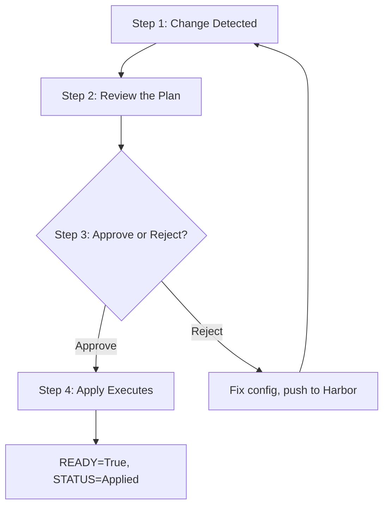

**Step 1: Change Detected**

- Adopter pushes new `AppEnvironment` config to Harbor
- Flux detects the change and applies the updated CR
- TF-Controller generates a Terraform plan

```bash
kubectl get terraform production-infra -n environments
# NAME              READY   STATUS                 AGE
# production-infra  False   Plan pending approval  5m
```

**Step 2: Review the Plan**

```bash
# View the pending plan
kubectl describe terraform production-infra -n environments

# Or retrieve the full plan output
kubectl get terraform production-infra -n environments \
    -o jsonpath='{.status.plan.pending}'
```

**Review shows:**
- Resources to be created/modified/destroyed
- Potential impact on running workloads

**Step 3: Approve or Reject**

To **APPROVE** the plan:

```bash
kubectl annotate terraform production-infra -n environments \
    "tf.weave.works/approve=approve-$(kubectl get terraform \
      production-infra -n environments \
      -o jsonpath='{.status.plan.pending}')"

# Or using tfctl (TF-Controller CLI):
tfctl approve production-infra -n environments
```

To **REJECT** (re-plan with different config):
- Fix the configuration in the `AppEnvironment`
- Push updated artifact to Harbor
- TF-Controller will generate a new plan

**Step 4: Apply Executes**

After approval:
- TF-Controller runs `terraform apply`
- Status updates to reflect progress
- On completion: `READY=True`, `STATUS=Applied`

```bash
kubectl get terraform production-infra -n environments
# NAME              READY   STATUS    AGE
# production-infra  True    Applied   15m
```

#### 5.6.4 Destruction Protection

To prevent accidental deletion of production infrastructure, enable destruction protection:

```yaml
apiVersion: mojaloop.io/v1alpha1
kind: AppEnvironment
metadata:
  name: production
  annotations:
    # Prevent Flux from deleting this resource
    kustomize.toolkit.fluxcd.io/prune: disabled
spec:
  suite: "v1.0.0"
  provider: proxmox
  terraform:
    approvePlan: disable
    destroyResourcesOnDeletion: false  # TF-Controller won't run terraform destroy
  # ...
```

**Protection Layers:**

| Protection | Purpose | Configuration |
|------------|---------|---------------|
| **Prune Disabled** | Prevents Flux from removing the CR if deleted from config | `kustomize.toolkit.fluxcd.io/prune: disabled` |
| **Destroy Disabled** | Prevents TF-Controller from running `terraform destroy` | `destroyResourcesOnDeletion: false` |
| **Manual Approval** | Requires human review for any infrastructure change | `approvePlan: disable` |
| **Finalizer Hold** | Adds manual confirmation step before resource deletion | Custom finalizer webhook (optional) |

#### 5.6.5 Recommended Approval Matrix

| Environment | `approvePlan` | `destroyResourcesOnDeletion` | `prune` |
|-------------|--------------|------------------------------|---------|
| Development | `auto` | `true` | `enabled` |
| Test/Staging | `auto` | `false` | `enabled` |
| Production | `disable` | `false` | `disabled` |
| DR/Standby | `disable` | `false` | `disabled` |

### 5.7 MinIO (S3-Compatible Object Storage)

MinIO provides S3-compatible object storage within the Control Center. It serves as the shared storage backend for multiple components.

**Use Cases:**

| Consumer | Bucket | Purpose |
|----------|--------|---------|
| Harbor | `harbor` | Container image layers, Helm charts, OCI artifacts. |
| Vault | `vault` | Encrypted secrets backend storage. |
| TF-Controller | `terraform-state` | Terraform state files for all managed environments. |

**Why MinIO?**

- **Open Source:** Apache 2.0 licensed, fully open source.
- **S3 Compatible:** Works with any S3-compatible tooling (AWS CLI, Terraform S3 backend, etc.).
- **Self-Contained:** No external dependencies; runs entirely within the Control Center.
- **Cloud Portable:** When deploying to cloud providers, MinIO can be replaced with native S3/Blob storage.

---

## 6. Day 0: Bootstrap Workflow

This section describes the complete deployment lifecycle, from bootstrapping the Control Center to provisioning Application Environments.

### 6.1 Overview: The Three Phases

The bootstrap process is divided into three distinct phases:

| Phase | Actor | Action | Result |
|-------|-------|--------|--------|
| **Phase 1** | Adopter (one-time) | Run Terraform from workstation | Generic Control Center running |
| **Phase 2** | Adopter | Push environment config to Harbor | Control Center customized |
| **Phase 3** | Control Center (automated) | TF-Controller provisions infrastructure | App Environments running |

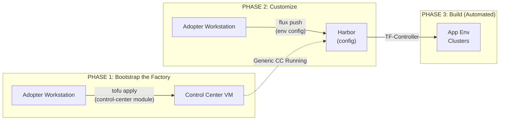

### 6.2 Prerequisites

Before starting the bootstrap process, the adopter must have:

| Requirement | Description |
|-------------|-------------|
| **Workstation** | A machine with `tofu`/`terraform`, `flux`, `kubectl`, and `talosctl` CLI tools. |
| **Infrastructure Access** | Credentials for the target infrastructure provider (e.g., Proxmox API token). |
| **Vendor Registry Access** | Credentials to pull from the Vendor OCI Registry (if private). |
| **Network Connectivity** | Workstation can reach both the Vendor Registry (internet) and the target infrastructure. |

### 6.3 Phase 1: Bootstrap the Factory (Control Center)

This phase is executed **once** from the adopter's workstation. It creates a generic, unconfigured Control Center.

#### Step 1.1: Clone Bootstrap Repository

```bash
git clone https://github.com/mojaloop/control-center-bootstrap
cd control-center-bootstrap
```

> **Result:** Bootstrap Terraform code available locally.

#### Step 1.2: Configure Provider Credentials and YAML Config

```bash
# For Proxmox: Set environment variables for provider auth
export PROXMOX_VE_ENDPOINT="https://proxmox.example.com:8006"
export PROXMOX_VE_API_TOKEN="user@pam!token=xxx"
```

Edit the YAML configuration file (`config/config.yaml`):

```yaml
provider: proxmox
deployment_template: small  # or: tiny, ha

network:
  vip: 192.168.88.12
  dmz-cidr: 192.168.101.0/24
  internal-cidr: 192.168.88.0/24

vm-placement-mapping:
  regions:
    region-1:
      provider_value: pr-site
      zones:
        zone-1:
          provider_value: ml-cluster
          placement-groups:
            placement-group-1:
              provider_value: node0
```

> **Result:** Provider credentials (env vars) and config (YAML) ready.

#### Step 1.3: Provision Control Center Infrastructure

```bash
tofu init
tofu plan
tofu apply
```

**Terraform performs:**
1. Creates VM(s) on target provider (Proxmox/AWS/GCP/etc.)
2. Bootstraps Kubernetes (Talos for Category A, managed for B)
3. Installs Flux CD and configures source (Git or OCI)

**Flux then automatically deploys (via reconciliation):**
4. Platform layer (Cilium, storage, Vault, etc.)
5. Networking layer (cert-manager, external-dns, etc.)
6. Apps layer (Harbor, MinIO, TF-Controller, Gitea, etc.)

> **Result:** Control Center running with full stack.

#### Step 1.4: Save Outputs

```bash
tofu output -json > control-center-outputs.json
```

**Outputs include:**
- `harbor_url`: "https://harbor.cc.example.com"
- `harbor_admin_password`: (sensitive)
- `kubeconfig`: (sensitive, for emergency access only)
- `vault_root_token`: (sensitive, for initial setup)

> **Result:** Control Center access credentials saved securely.

**Post-Phase 1 State:**
- A generic Control Center is running with no environment definitions.
- Harbor is proxying Vendor artifacts.
- Flux is running but has no `AppEnvironment` CRs to process.
- The Control Center is ready to be customized.

### 6.4 Phase 2: Customize the Factory (Push Configuration)

In this phase, the adopter defines their Application Environments and pushes the configuration to the Control Center's Harbor.

The Control Center uses a **"Master Inventory"** pattern. It watches a single OCI artifact (`env-config`) that contains the definitions for *all* active environments. To create a new environment, you simply add its file to this inventory and re-push.

#### Step 2.1: Create Environment Inventory

Create a directory to hold your environment definitions:

```bash
mkdir -p environments && cd environments
```

**1. Define Development Environment (`dev.yaml`):**

```yaml
apiVersion: mojaloop.io/v1alpha1
kind: AppEnvironment
metadata:
  name: development
spec:
  suite: "v1.0.0"
  provider: proxmox
  # This config matches the config.yaml structure used for CC
  config:
    deployment_template: tiny
    cluster_name: ml-dev
    network:
      vip: 192.168.88.13
```

**2. Define Production Environment (`prod.yaml`):**

```yaml
apiVersion: mojaloop.io/v1alpha1
kind: AppEnvironment
metadata:
  name: production
spec:
  suite: "v1.0.0"
  provider: proxmox
  config:
    deployment_template: ha-large
    cluster_name: ml-prod
    network:
      vip: 192.168.88.14
```

**3. Create `kustomization.yaml` (The Inventory List):**

This file tells Flux which environments to manage.

```yaml
apiVersion: kustomize.config.k8s.io/v1beta1
kind: Kustomization
resources:
  - dev.yaml
  - prod.yaml
  # To add a new env, simply add it here and push!
```

> **Result:** Environment inventory created locally.

#### Step 2.2: Push Configuration to Control Center Harbor

The Control Center is configured to watch `oci://harbor.cc.example.com/config/env-config`. Pushing to this tag triggers the update.

```bash
# Login to Control Center Harbor
flux login oci://harbor.cc.example.com --username admin

# Push the inventory as an OCI artifact
flux push artifact \
    oci://harbor.cc.example.com/config/env-config:v1.0.0 \
    --path=./environments \
    --source="local" \
    --revision="v1.0.0"
```

> **Result:** Configuration artifact stored in Control Center Harbor.

#### Step 2.3: Flux Reconciles the Inventory

1.  **Detection:** Control Center Flux detects the new `env-config:v1.0.0` artifact.
2.  **Expansion:** It reads the `kustomization.yaml` inventory list.
3.  **Application:** It applies `dev.yaml` and `prod.yaml` to the Control Center cluster.
4.  **Creation:** Two `AppEnvironment` Custom Resources are created in the cluster.

> **Result:** The Control Center now "knows" about Dev and Prod. This triggers Phase 3.

**Post-Phase 2 State:**
- `AppEnvironment` CRs (dev, prod) exist in the Control Center cluster.
- TF-Controller detects the new CRs and begins Phase 3 automatically.

### 6.5 Phase 3: The Factory Builds the Products (Automated)

This phase is **fully automated**. The Control Center's Flux and TF-Controller provision the Application Environments without human intervention.

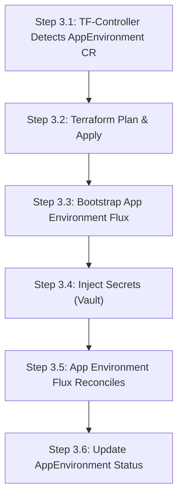

#### Step 3.1: TF-Controller Detects AppEnvironment CR

TF-Controller watches for `AppEnvironment` resources. When detected, it:
1. Selects the appropriate provider module (e.g., `proxmox`)
2. Generates a Terraform workspace
3. Retrieves provider credentials from Vault

> **Result:** Terraform workspace configured for the environment.

#### Step 3.2: Terraform Plan & Apply (Infrastructure)

TF-Controller executes:
1. `terraform init` (modules from Harbor proxy cache)
2. `terraform plan` (stored in MinIO)
3. `terraform apply` (auto-approved for GitOps flow)

**Terraform creates:**
- VMs on the target provider (Proxmox)
- Network configuration
- Talos Linux installation
- Kubernetes cluster bootstrap
- **Direct Injection:** Writes `cluster-vars` ConfigMap and `cluster-secrets` Secret directly into the new cluster (Same as CC bootstrap).

> **Result:** Bare Kubernetes cluster running (no workloads yet) with configuration injected.

#### Step 3.3: Bootstrap App Environment Flux

Control Center Flux:
1. Retrieves the new cluster's kubeconfig from Terraform output
2. Installs Flux into the App Environment cluster
3. Creates `OCIRepository` pointing to Control Center Harbor
4. Creates `Kustomization` to apply the app configuration
   *   *Note:* The Flux Kustomization uses `substituteFrom: [{ kind: ConfigMap, name: cluster-vars }]` to read the configuration Terraform just injected.

> **Result:** App Environment Flux running, watching Harbor.

#### Step 3.4: Inject Secrets (Vault Integration)

Control Center Vault:
1. Generates unseal keys for the App Environment's Vault
2. Stores initial secrets (DB passwords, API keys) if configured
3. Configures transit encryption for secret sharing

> **Result:** App Environment Vault initialized and unsealed.

#### Step 3.5: App Environment Flux Reconciles (Automatic)

The App Environment's Flux:
1. Pulls the app configuration artifact from Control Center Harbor
2. Reads `HelmRelease` definitions
3. Pulls Helm charts from Harbor (vendor proxy cache)
4. Deploys the Mojaloop application

> **Result:** Application running in the new environment.

#### Step 3.6: Update AppEnvironment Status

TF-Controller updates the `AppEnvironment` CR status:

```yaml
status:
  phase: Running
  clusterEndpoint: "https://ml-prod.example.com:6443"
  suiteVersion: "v1.0.0"
  lastReconciled: "2026-01-29T10:30:00Z"
  conditions:
    - type: InfrastructureReady
      status: "True"
    - type: FluxBootstrapped
      status: "True"
    - type: ApplicationDeployed
      status: "True"
```

> **Result:** Environment status visible via `kubectl` on Control Center.

### 6.6 Post-Bootstrap Verification

After Phase 3 completes, verify the deployment from the Control Center:

```bash
# Check AppEnvironment status
kubectl get appenvironments -n environments
# NAME          PHASE     CLUSTER-ENDPOINT                    SUITE-VERSION   AGE
# development   Running   https://ml-dev.example.com:6443     v1.0.0          10m
# production    Running   https://ml-prod.example.com:6443    v1.0.0          8m

# Check TF-Controller Terraform resources
kubectl get terraforms -n environments
# NAME              READY   STATUS    AGE
# development-infra True    Applied   10m
# production-infra  True    Applied   8m

# Check Flux status on Control Center
flux get all -A

# (Optional) Access an App Environment cluster
export KUBECONFIG=$(kubectl get secret ml-prod-kubeconfig -n environments -o jsonpath='{.data.value}' | base64 -d)
kubectl get pods -n mojaloop
```

### 6.7 Bootstrap Summary

| Phase | Duration | Human Effort | Result |
|-------|----------|--------------|--------|
| Phase 1 | ~15-30 min | High (run Terraform) | Generic Control Center |
| Phase 2 | ~5 min | Medium (define envs, push config) | Control Center customized |
| Phase 3 | ~20-45 min per env | None (automated) | App Environments running |

**Total Time to First Environment:** ~40-80 minutes (depending on infrastructure speed)
**Time for Additional Environments:** ~20-45 minutes each (fully automated after Phase 2)

---

## 7. Day 1: Configuration Updates

This section describes how the adopter modifies application configuration after the initial deployment.

### 7.1 The Workflow

**Scenario:** The adopter wants to change the application replica count from 2 to 5.

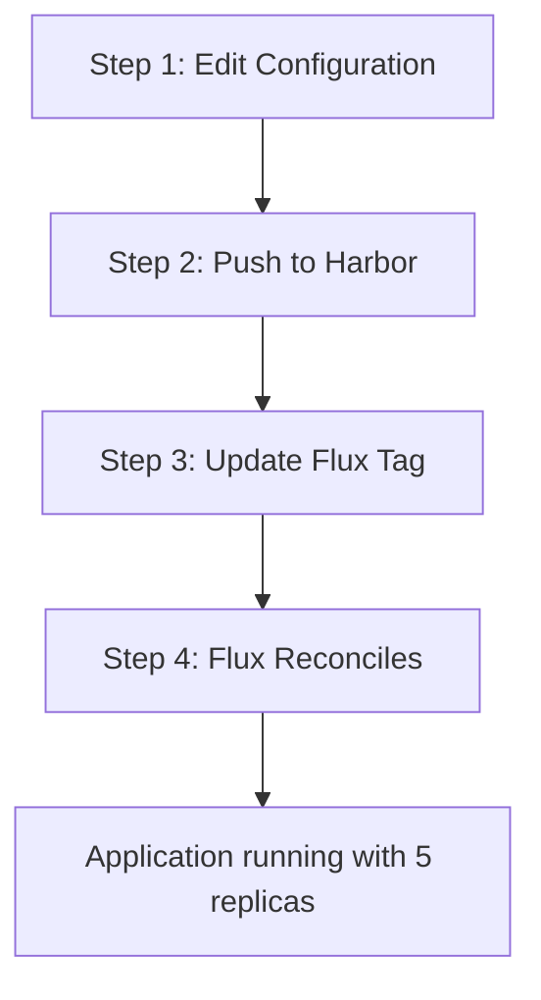

#### Step 1: Edit Configuration (Human Activity)

Edit the environment definition in the Master Inventory (`environments/prod.yaml`):

```yaml
apiVersion: mojaloop.io/v1alpha1
kind: AppEnvironment
metadata:
  name: production
spec:
  suite: "v1.0.0"
  provider: proxmox
  config:
    deployment_template: ha-large
    cluster_name: ml-prod
  # Add or modify values for application configuration
  values:
    app:
      replicas: 5  # Changed from 2
```

(Optional) Commit to local Git for history:

```bash
git add environments/prod.yaml
git commit -m "Increase production replicas to 5"
```

#### Step 2: Push to Harbor (The "Sync" Command)

```bash
make sync

# Internally executes:
flux push artifact \
    oci://harbor.internal/config/env-config:v1.1.0 \
    --path=./environments \
    --source="local" \
    --revision="v1.1.0"
```

> **Result:** New artifact v1.1.0 pushed to Harbor.

#### Step 3: Update Flux to Use New Version

**Option A: Manual Tag Update (Recommended for Production)**

```bash
kubectl patch ocirepository env-config -n flux-system \
    --type merge -p '{"spec":{"ref":{"tag":"v1.1.0"}}}'
```

**Option B: Use a Mutable Tag (e.g., "latest" - for Dev only)**

Flux will auto-detect the new digest on the next interval.

#### Step 4: Flux Reconciles (Automatic)

- Flux detects the new artifact tag/digest
- Flux pulls and extracts the new config
- Flux detects the change in replicas: 2 → 5
- Flux updates the `HelmRelease`
- Kubernetes scales the deployment to 5 replicas

> **Result:** Application now running with 5 replicas.

### 7.2 Important Notes

- **Git Commit is Optional:** The cluster does not see Git. Committing to local Git is purely for the adopter's internal audit trail.
- **Changes Do Not Apply Until Pushed:** Editing `values.yaml` locally has no effect on the cluster until `make sync` (or `flux push artifact`) is executed.
- **Immutable Tags are Recommended:** Use semantic versions (`v1.1.0`) instead of mutable tags (`latest`) for production environments to ensure traceability.

---

## 8. Day 2: Application Upgrades

This section describes how the adopter upgrades to a new Mojaloop Suite version.

### 8.1 The Workflow

**Scenario:** The Platform Team releases Mojaloop Suite v1.1.0. The adopter wants to upgrade from v1.0.0.

The **Mojaloop Suite** bundles all component versions together (see Section 4.2). Adopters upgrade by changing a single version number in their `AppEnvironment` CR—not by editing individual `HelmRelease` definitions. This ensures all components are upgraded together with tested compatibility.

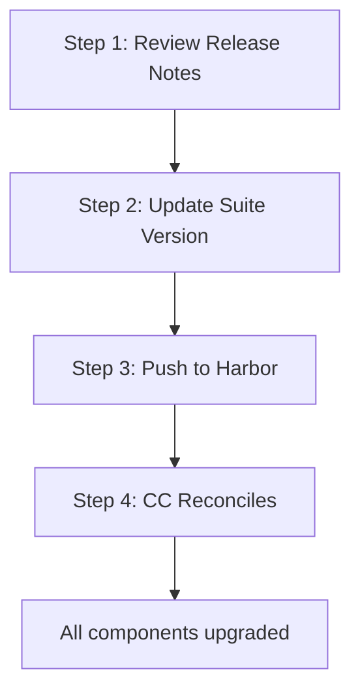

#### Step 1: Review Release Notes

```bash
flux pull artifact oci://harbor.internal/mojaloop/suite:v1.1.0 \
    --output=- | yq '.spec.releaseNotes'
```

**Review:**
- Breaking changes
- New configuration options
- Migration steps (if any)
- Component versions included in the Suite

#### Step 2: Update Suite Version in AppEnvironment CR

Edit `environments/prod.yaml`:

```yaml
apiVersion: mojaloop.io/v1alpha1
kind: AppEnvironment
metadata:
  name: production
spec:
  suite: "v1.1.0"  # Changed from v1.0.0 - this is the only change!
  provider: proxmox
  cluster:
    name: ml-prod
    # ... rest unchanged ...
```

> **Note:** All component versions (mojaloop-core, mojaloop-backend, etc.) are automatically resolved from the Suite manifest.

#### Step 3: Push Updated Configuration to Harbor

```bash
flux push artifact \
    oci://harbor.internal/config/env-config:v1.1.0 \
    --path=./environments \
    --source="local" \
    --revision="v1.1.0"

# Trigger reconciliation
flux reconcile source oci env-config -n flux-system
```

#### Step 4: Control Center Reconciles (Automatic)

The Control Center's Flux and TF-Controller:
1. Detect the updated `AppEnvironment` CR (`suite: v1.1.0`)
2. Read the Suite v1.1.0 manifest to resolve component versions
3. Update the App Environment's Flux configuration
4. App Environment Flux pulls new Helm chart versions from Harbor
5. Helm upgrades are performed for each component
6. Kubernetes rolls out the new application versions

> **Result:** All components upgraded to Suite v1.1.0 versions.

### 8.2 Rollback Procedure

If the upgrade fails or causes issues:

```bash
# Option 1: Revert the Suite version in AppEnvironment CR
# Edit environments/prod.yaml: change suite: "v1.1.0" back to "v1.0.0"
# Then push and reconcile:
flux push artifact oci://harbor.internal/config/env-config:rollback \
    --path=./environments --source="local" --revision="rollback"
flux reconcile source oci env-config -n flux-system

# Option 2: Flux will automatically rollback individual HelmReleases if configured
# Check HelmRelease status:
flux get helmreleases -A

# Option 3: Manual Helm rollback for a specific component (if needed)
helm rollback mojaloop-core -n mojaloop
```

### 8.3 Overriding Component Versions (Advanced)

In some cases, an adopter may need to use a different version of a specific component than what the Suite specifies. This is an **advanced** use case and should be used sparingly, as it breaks the compatibility guarantee provided by the Suite.

**When to Override:**
- Hotfix for a critical bug before the next Suite release
- Testing a pre-release component version
- Regulatory or compliance requirement for a specific version

**How to Override:**

Add the `componentOverrides` field to the `AppEnvironment` spec:

```yaml
apiVersion: mojaloop.io/v1alpha1
kind: AppEnvironment
metadata:
  name: production
spec:
  suite: "v1.0.0"              # Base Suite version
  provider: proxmox
  cluster:
    name: ml-prod
    # ...
  
  # Override specific component versions (use sparingly!)
  componentOverrides:
    mojaloop-core: "2.0.1"     # Override just this component
    # Other components remain at Suite-defined versions
```

**Important Considerations:**
- Overridden components are **not tested together** by the Platform Team
- The adopter assumes responsibility for compatibility
- Document why the override is needed for audit purposes
- Remove overrides when upgrading to a Suite that includes the fix

---

## 9. Technical Reference

### 9.1 Key CLI Commands

#### Flux CLI

| Command | Description |
|---------|-------------|
| `flux push artifact oci://<registry>/<repo>:<tag> --path=<dir>` | Package a directory into an OCI artifact and push to registry. |
| `flux pull artifact oci://<registry>/<repo>:<tag> --output=<dir>` | Download and extract an OCI artifact to a local directory. |
| `flux install` | Install Flux components into the current Kubernetes cluster. |
| `flux get sources oci` | List all OCIRepository sources and their sync status. |
| `flux get helmreleases -A` | List all HelmReleases and their status across all namespaces. |
| `flux reconcile source oci <name>` | Force an immediate sync of an OCIRepository. |

#### OpenTofu / Terraform

| Command | Description |
|---------|-------------|
| `tofu init` | Initialize the Terraform working directory, download modules. |
| `tofu plan` | Preview infrastructure changes (reads `config/config.yaml`). |
| `tofu apply` | Apply infrastructure changes. |
| `tofu destroy` | Destroy all managed infrastructure. |

**Note:** Configuration is loaded from `config/config.yaml` via the `config-loader` module. No `-var-file` flag is needed.

### 9.2 Key Kubernetes Resources

#### OCIRepository (Flux Source)

**For Master Inventory (env-config):**

```yaml
apiVersion: source.toolkit.fluxcd.io/v1beta2
kind: OCIRepository
metadata:
  name: env-config
  namespace: flux-system
spec:
  interval: 1m                                    # Check frequently for inventory changes
  url: oci://harbor.internal/config/env-config    # The OCI artifact URL (Master Inventory)
  ref:
    tag: v1.0.0                                   # The specific version to deploy
  secretRef:
    name: harbor-credentials                      # Registry credentials (if needed)
```

**For Vendor Templates (flux-templates):**

```yaml
apiVersion: source.toolkit.fluxcd.io/v1beta2
kind: OCIRepository
metadata:
  name: flux-templates
  namespace: flux-system
spec:
  interval: 1h                                    # Vendor templates change less frequently
  url: oci://harbor.internal/vendor-cache/flux-templates
  ref:
    tag: v1.0.0                                   # Suite version
```

#### Kustomization (Flux Deployment)

**Note:** Kustomizations are defined in the Vendor's `flux-templates` artifact, not by the adopter. The adopter only maintains `AppEnvironment` CRs in the `env-config` inventory.

```yaml
# Example from Vendor's flux-templates (platform.yaml layer)
apiVersion: kustomize.toolkit.fluxcd.io/v1
kind: Kustomization
metadata:
  name: platform
  namespace: flux-system
spec:
  interval: 10m
  sourceRef:
    kind: OCIRepository
    name: flux-templates                          # Points to Vendor templates
  path: ./platform                                # Path within the artifact
  prune: true                                     # Delete resources removed from config
  postBuild:
    substituteFrom:
      - kind: ConfigMap
        name: cluster-vars                        # Injected by Terraform
```

#### HelmRelease (Application Deployment)

```yaml
apiVersion: helm.toolkit.fluxcd.io/v2
kind: HelmRelease
metadata:
  name: mojaloop
  namespace: apps
spec:
  interval: 15m
  chart:
    spec:
      chart: mojaloop
      version: "1.0.0"
      sourceRef:
        kind: HelmRepository
        name: vendor-charts
  values:
    replicas: 3
    logLevel: info
  valuesFrom:
    - kind: Secret
      name: db-credentials        # Created by ESO from Vault
      valuesKey: values.yaml
```

#### ExternalSecret (Vault to Kubernetes Secret)

```yaml
apiVersion: external-secrets.io/v1beta1
kind: ExternalSecret
metadata:
  name: db-credentials
  namespace: apps
spec:
  refreshInterval: 1h
  secretStoreRef:
    name: vault-backend           # References the Vault ClusterSecretStore
    kind: ClusterSecretStore
  target:
    name: db-credentials          # K8s Secret name (used by HelmRelease above)
    creationPolicy: Owner
  data:
    - secretKey: values.yaml
      remoteRef:
        key: secret/data/mojaloop/db    # Vault path
        property: values                 # Key within Vault secret
```

### 9.3 Directory Structure

The adopter maintains two types of configuration:

**1. Control Center Configuration (Local Only):**

```
config/
└── config.yaml                 # Control Center infrastructure definition
                                # Stays on adopter's workstation (local file)
                                # Never pushed to Harbor
```

**2. Application Environment Inventory (Pushed to Harbor):**

```
environments/
├── dev.yaml                    # AppEnvironment CR for dev cluster
├── prod.yaml                   # AppEnvironment CR for production cluster
├── dr.yaml                     # AppEnvironment CR for DR cluster
└── kustomization.yaml          # Master Inventory list
                                # resources: [dev.yaml, prod.yaml, dr.yaml]
```

**Key Points:**

- **CC Config (`config/config.yaml`):** Defines the Control Center infrastructure. This file stays on the adopter's workstation and is used once during initial bootstrap. It is backed up securely but never pushed to Harbor.

- **Environment Inventory (`environments/`):** Contains `AppEnvironment` Custom Resources that define all application environments. This directory is pushed to Harbor as the `env-config` OCI artifact (Master Inventory pattern).

- **No HelmReleases or Kustomizations:** The adopter does NOT maintain HelmRelease, Kustomization, or Source definitions. These come from the Vendor's generic `flux-templates` OCI artifact.

- **Variable Substitution:** The Vendor's generic templates use `${VAR}` placeholders. Flux substitutes these at runtime using the `cluster-vars` ConfigMap that Terraform injects directly into each cluster.

### 9.4 Environment Management

**Pushing the Master Inventory:**

All environments are managed as a single inventory artifact:

```bash
# Push all environment definitions as one artifact
flux push artifact oci://harbor.internal/config/env-config:v1.0.0 \
    --path=./environments \
    --source="local" \
    --revision="v1.0.0"
```

**Adding a New Environment:**

1. Create `staging.yaml` in the `environments/` directory
2. Add it to `kustomization.yaml` resources list
3. Push the updated inventory to Harbor
4. Control Center Flux detects the change and TF-Controller provisions the new environment

---

## 10. Disaster Recovery & Business Continuity

### 10.1 Overview

This section defines the disaster recovery (DR) and business continuity strategies for both the Control Center and Application Environments. The architecture is designed with recovery in mind, leveraging the immutable, versioned nature of OCI artifacts and centralized state management.

### 10.2 Recovery Objectives

| Component | RTO (Recovery Time Objective) | RPO (Recovery Point Objective) | Notes |
|-----------|-------------------------------|--------------------------------|-------|
| **Control Center** | 2-4 hours | 1 hour | Full rebuild from backups |
| **App Environment (Prod)** | 1-2 hours | 15 minutes | Depends on data tier |
| **App Environment (Dev/Test)** | 4-8 hours | 24 hours | Lower priority |

### 10.3 Backup Strategy

#### 10.3.1 Control Center Backups

The Control Center manages critical state that must be backed up regularly:

| Component | Data to Backup | Backup Method | Frequency | Retention |
|-----------|---------------|---------------|-----------|-----------|
| **MinIO** | All buckets (Harbor, Vault, TF State) | S3-compatible replication to external storage | Continuous | 30 days |
| **Vault** | Encrypted backend + unseal keys | Raft snapshots to MinIO + external copy | Hourly | 90 days |
| **Terraform State** | All `.tfstate` files | Versioned in MinIO (automatic) | On change | 90 days |
| **Harbor** | OCI artifacts, database | Built-in replication + MinIO backup | Continuous | 30 days |
| **Etcd (Talos)** | Cluster state | Talos etcd snapshots | Every 6 hours | 7 days |

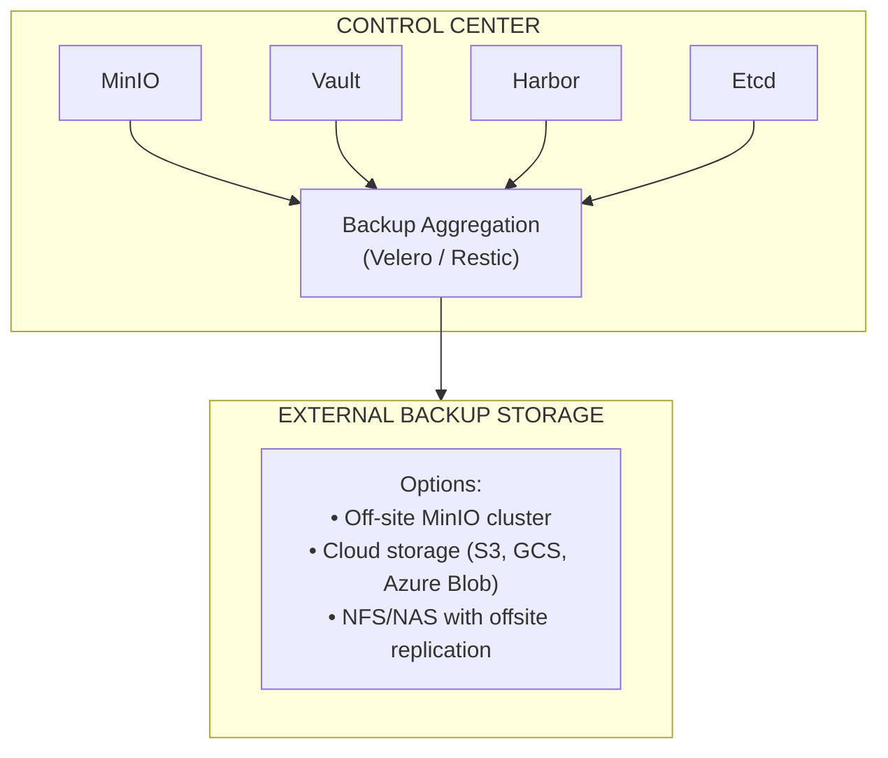

#### 10.3.2 Application Environment Backups

Application Environments are primarily **stateless from an infrastructure perspective**—the Control Center can recreate them. However, application data requires separate backup strategies:

| Data Type | Backup Responsibility | Method |
|-----------|----------------------|--------|
| **Kubernetes State** | Control Center | Recreatable via TF-Controller + Flux |
| **Application Databases** | Application Layer | Vendor-provided backup solutions |
| **Persistent Volumes** | Adopter | Velero + CSI snapshots |

### 10.4 Control Center Recovery Procedures

#### 10.4.1 Scenario: Control Center Total Loss

If the Control Center is completely destroyed:

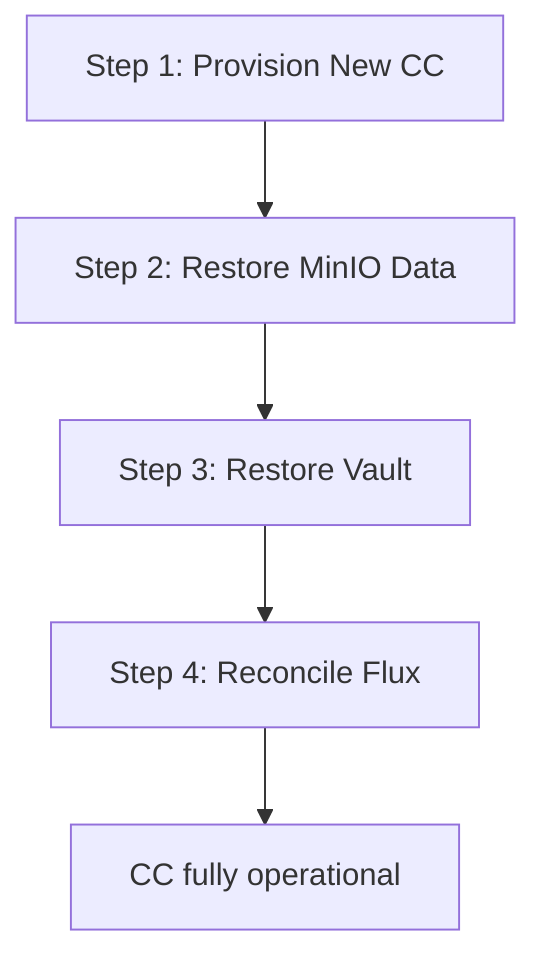

#### Step 1: Provision New Control Center Infrastructure

From the adopter's workstation (using saved `config/config.yaml`):

```bash
cd control-center-bootstrap
cp /backup/config.yaml config/config.yaml   # Restore saved config
tofu init
tofu apply
```

> **Result:** Fresh Control Center running (no state, no data).

#### Step 2: Restore MinIO Data

Restore MinIO buckets from external backup:

```bash
mc mirror backup-storage/minio-backup/ minio-new/
```

**This restores:**
- Harbor data (OCI artifacts, database)
- Vault encrypted backend
- Terraform state files

> **Result:** All persistent data restored.

#### Step 3: Restore Vault

Using saved unseal keys (stored securely offline):

```bash
vault operator unseal <key1>
vault operator unseal <key2>
vault operator unseal <key3>
```

> **Result:** Vault operational with all secrets intact.

#### Step 4: Reconcile Flux

Flux will automatically:
- Detect `AppEnvironment` CRs from restored Harbor artifacts
- Verify existing App Environments are still running
- Re-establish management connections

```bash
flux reconcile source oci env-config
kubectl get appenvironments -n environments
```

> **Result:** Control Center fully operational, managing all environments.

**Critical Artifacts to Store Offline:**
- `config/config.yaml` (Control Center YAML configuration)
- `control-center-outputs.json` (includes Vault root token, Harbor admin password)
- Vault unseal keys (split across multiple secure locations)
- External backup storage credentials

#### 10.4.2 Scenario: Control Center Degraded (Single Component Failure)

| Failed Component | Recovery Action | Downtime Impact |
|-----------------|-----------------|-----------------|
| **MinIO** | Restore from replica or backup | Harbor/Vault unavailable until restored |
| **Harbor** | Reinstall, restore from MinIO | No new deployments; existing apps unaffected |
| **Vault** | Restore from snapshot, unseal | Secret rotation blocked; existing secrets in K8s still work |
| **Flux** | Reinstall via Helm | No reconciliation; manual kubectl still works |
| **TF-Controller** | Reinstall via Helm | No infra changes; existing environments unaffected |

### 10.5 Application Environment Recovery

#### 10.5.1 Scenario: App Environment Total Loss

If an Application Environment cluster is destroyed:

```bash
# The Control Center still has the AppEnvironment CR and Terraform state.
# Simply trigger a reconciliation:

$ kubectl annotate appenvironment production -n environments \
    reconcile.fluxcd.io/requestedAt="$(date +%s)"

# TF-Controller will:
# 1. Detect the infrastructure is missing
# 2. Run terraform apply to recreate VMs/cluster
# 3. Bootstrap Flux in the new cluster
# 4. Flux will deploy the application from Harbor artifacts

# Application data must be restored separately from application-level backups.
```

#### 10.5.2 Active-Passive DR Pattern

For critical production environments, deploy a standby environment:

```yaml
# production.yaml
apiVersion: mojaloop.io/v1alpha1
kind: AppEnvironment
metadata:
  name: production
spec:
  provider: proxmox
  cluster:
    name: ml-prod
    # ... primary config ...

---
# production-dr.yaml
apiVersion: mojaloop.io/v1alpha1
kind: AppEnvironment
metadata:
  name: production-dr
spec:
  provider: proxmox  # Or different provider/location for geographic redundancy
  cluster:
    name: ml-prod-dr
    # ... same config as production ...
  standby: true  # Indicates passive standby (app deployed but scaled down)
```

**Failover Procedure:**
1. Update DNS/load balancer to point to DR environment
2. Scale up DR environment: `kubectl scale --replicas=3 deployment/mojaloop -n apps`
3. Verify application health
4. Investigate and recover primary environment

### 10.6 Data Protection Considerations

| Data Category | Protection Mechanism | Recovery Method |
|--------------|---------------------|-----------------|
| **OCI Artifacts** | Harbor replication + MinIO backup | Restore MinIO or re-push from source |
| **Terraform State** | Versioned in MinIO with backup | Restore from backup; state contains infra mapping |
| **Vault Secrets** | Encrypted at rest, Raft snapshots | Restore snapshot + unseal keys |
| **App Environment Kubeconfigs** | Generated by TF-Controller, stored in K8s secrets | Regenerated on environment recreation |

### 10.7 Testing DR Procedures

**Recommended DR Test Schedule:**

| Test Type | Frequency | Scope |
|-----------|-----------|-------|
| Backup verification | Weekly | Verify backups are valid and restorable |
| Component recovery | Monthly | Recover single component (Vault, Harbor) |
| Control Center rebuild | Quarterly | Full Control Center rebuild from backups |
| App Environment failover | Quarterly | Failover to DR environment and back |
| Full DR simulation | Annually | Complete disaster scenario with RTO/RPO validation |

---

## 11. Security Model

### 11.1 Trust Boundaries

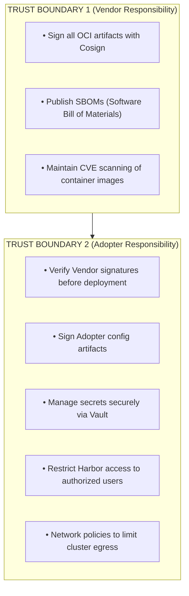

### 11.2 Signature Verification

Flux can be configured to verify OCI artifact signatures before applying them:

```yaml
apiVersion: source.toolkit.fluxcd.io/v1beta2
kind: OCIRepository
metadata:
  name: env-config          # Or flux-templates for Vendor artifacts
spec:
  # ... other fields ...
  verify:
    provider: cosign
    secretRef:
      name: cosign-public-key
```

### 11.3 Secrets Handling

**Core Principle:** No secrets are required at deployment time. The Control Center is bootstrapped without secrets, and all secrets are managed post-deployment through Vault.

**The Secrets Flow:**

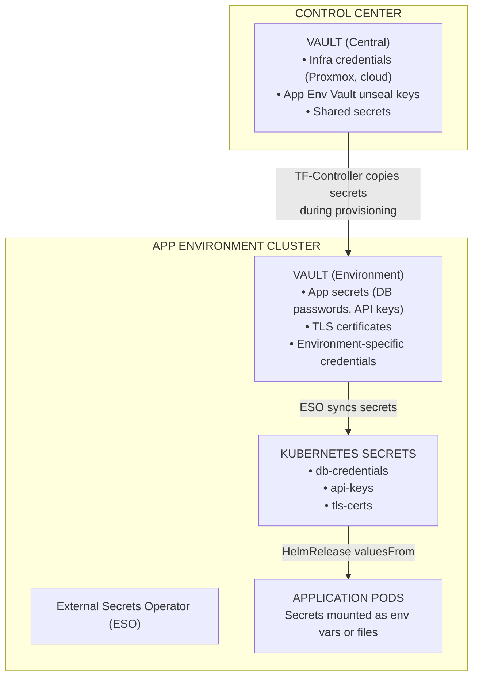

**Secrets Lifecycle:**

| Phase | Action | Actor |
|-------|--------|-------|
| **Day 0** | Control Center bootstrapped with no secrets | Terraform |
| **Post-Bootstrap** | Adopter stores infrastructure credentials in CC Vault | Adopter (manual or API) |
| **Env Provisioning** | TF-Controller copies required secrets to Env Vault | Automated |
| **App Deployment** | ESO syncs Vault secrets to K8s Secrets | Automated |
| **Runtime** | Applications consume secrets via env vars or mounts | Automated |

**Key Components:**

| Component | Location | Purpose |
|-----------|----------|---------|
| **Vault (Control Center)** | Control Center | Central secret store. Holds infra credentials and propagates secrets to environments. |
| **Vault (App Environment)** | Each App Env | Environment-specific secrets. Unsealed by CC Vault. |
| **External Secrets Operator (ESO)** | Each App Env | Syncs secrets from Vault to native Kubernetes Secrets. |

**Why This Approach?**

| Benefit | Description |
|---------|-------------|
| **No secrets in config artifacts** | OCI artifacts contain only non-sensitive configuration. Secrets never leave Vault. |
| **Centralized management** | All secrets are managed through Vault UI/API. No file-based secret management. |
| **Audit trail** | Vault provides full audit logging of secret access. |
| **Dynamic secrets** | Vault can generate dynamic credentials (e.g., database users) on demand. |
| **Rotation** | Secrets can be rotated in Vault; ESO automatically syncs changes. |

---

## 12. Glossary

| Term | Definition |
|------|------------|
| **OCI** | Open Container Initiative. A standard for container image formats and registries. |
| **OCI Artifact** | Any file (not just container images) stored in an OCI registry. Used here for Kubernetes manifests and Terraform modules. |
| **GitOps** | A practice where Git is the source of truth for infrastructure and application configuration. |
| **Gitless GitOps** | A variant of GitOps where OCI registries replace Git as the source of truth for the cluster. Git is still used by humans but not by the cluster. |
| **FluxCD** | A CNCF project that implements GitOps for Kubernetes. |
| **Harbor** | An open-source OCI registry with features like replication, vulnerability scanning, and access control. |
| **Talos** | A minimal, immutable Linux distribution designed for Kubernetes. |
| **OpenTofu** | An open-source fork of Terraform for infrastructure provisioning. |
| **Cosign** | A tool for signing and verifying container images and OCI artifacts. |
| **External Secrets Operator (ESO)** | A Kubernetes operator that syncs secrets from external secret management systems (like Vault) into native Kubernetes Secrets. |
| **HelmRelease** | A Flux custom resource that manages the lifecycle of a Helm chart installation. |
| **OCIRepository** | A Flux custom resource that defines an OCI artifact as a source. |
| **Kustomization** | A Flux custom resource that defines how to apply Kubernetes manifests from a source. |
| **Control Center** | The adopter's management cluster (Talos-based) that orchestrates infrastructure provisioning and application deployment. It hosts Harbor, MinIO, Vault, Flux, and TF-Controller. Does not run banking workloads. |
| **Control Plane** | In this architecture, refers to the Control Center and its management responsibilities (not to be confused with Kubernetes control plane nodes). |
| **Data Plane** | The Application Environment clusters that run the actual banking workloads. |
| **AppEnvironment** | A Custom Resource (CR) that defines an Application Environment, including infrastructure specifications and application configuration. Processed by the Control Center to provision new environments. |
| **TF-Controller** | Terraform Controller. A Kubernetes controller that allows Flux to manage Terraform workspaces, enabling GitOps-style infrastructure provisioning. |
| **MinIO** | An open-source, S3-compatible object storage system. Used in the Control Center for Harbor storage, Vault backend, and Terraform state. |
| **Bootstrap** | The initial process of installing Flux and connecting it to its source of truth. In this architecture, includes both Control Center bootstrap (Phase 1) and App Environment bootstrap (Phase 3). |
| **Reconciliation** | The process by which Flux detects drift between the desired state (in the source) and the actual state (in the cluster) and corrects it. |
| **Factory Model** | The architectural pattern where the Control Center acts as a "factory" that produces Application Environments based on declarative specifications. |
| **Provider Module** | A Terraform module that implements infrastructure provisioning for a specific provider (e.g., Proxmox, AWS, Azure). All modules implement a standard interface. |
| **Proxmox VE** | An open-source virtualization platform. The current primary infrastructure provider for on-premises deployments. |

---

## Document History

| Version | Date | Author | Changes |
|---------|------|--------|---------|
| 1.0 | 2026-01-29 | Architecture Team | Initial document creation. |
| 1.1 | 2026-01-29 | Architecture Team | Added Disaster Recovery & Business Continuity section (Section 9). Added Approval Gates documentation (Section 4.7). |
| 1.2 | 2026-01-29 | Architecture Team | Added YAML configuration approach (Section 4.3.1). Added Terragrunt decision rationale (Section 4.3.2). Updated all references from terraform.tfvars to YAML config. |
| 1.3 | 2026-01-29 | Architecture Team | Added Terraform module structure documentation (Section 4.3.3). Documented provider categories (self-managed vs cloud-managed) and module interface contracts. |
| 1.4 | 2026-01-29 | Architecture Team | Added configuration separation documentation (Section 4.3.4). Documented Flux layer dependency chain (sources → platform → infrastructure → apps). Documented post-build variable substitution and TF-Controller/Flux interaction flow. |
| 1.5 | 2026-01-29 | Architecture Team | Review and consistency fixes: Clarified Terraform only bootstraps Flux (not full stack). Added Data Layer as explicit 5th Flux layer. Fixed CC diagram to not hardcode Talos. Added Observability stack to CC components. |
| 1.6 | 2026-01-29 | Architecture Team | Renamed "infrastructure" layer to "networking" (avoiding K8s keyword "service"). Added "observability" as dedicated 4th layer. Now 6 layers total: sources → platform → networking → observability → data-layer → apps. Added observability architecture diagram showing CC as central hub with agents on App Envs. |
| 1.7 | 2026-01-30 | Architecture Team | Major restructure: Split "Vendor" into three actors (Mojaloop Dev Team, Mojaloop Platform Team, Adopter Technical Team). Added Section 4 (Artifact Lifecycle) with Mojaloop Suite distribution model. Documented GHCR registry structure, Cosign keyless signing, Suite manifest format. Updated all AppEnvironment CRs to use `suite` field. Renumbered all sections. |
| 1.8 | 2026-01-30 | Architecture Team | Consistency review fixes: Fixed Section 10 subsection numbering (9.x → 10.x). Corrected AWS provider status from "stable" to "planned". Clarified `env-config` vs `cluster-config` naming in Section 5.2. Rewrote Section 8 to emphasize Suite-based upgrades with new Section 8.3 for component overrides. Added Section 5.3 to Platform Team relevant sections. Standardized Harbor URLs to use `harbor.internal` for in-cluster references. Updated status outputs to show `SUITE-VERSION`. |
| 1.9 | 2026-01-30 | Architecture Team | Removed Crossplane references; TF-Controller on CC provisions managed services for Category B. Clarified observability architecture: Grafana/Mimir/Loki/Tempo only on CC; App Envs have collectors only. |
| 2.0 | 2026-01-30 | Architecture Team | Converted all ASCII diagrams to Mermaid format for improved maintainability and rendering. Restructured Day 0/1/2 workflows with proper markdown sections. Simplified diagram complexity while preserving information. |
| 2.1 | 2026-01-30 | Architecture Team | Optimized Section 2.1 Architecture Overview diagram: simplified subgraph nesting, added direction hints for better layout, removed invalid HTML comment, grouped App Environments as single target for cleaner flow lines. |
| 2.2 | 2026-01-30 | Architecture Team | Fixed inconsistencies throughout document: (1) Section 2.3 - CC Config stays local (not pushed to Harbor); (2) Section 5.2 - Removed `cluster-config` from Harbor projects; (3) Section 7.1 - Fixed Day 1 workflow to use `env-config` (not `cluster-config`); (4) Sections 9.3-9.4 - Rewrote Directory Structure to show correct `environments/` and `config/` layout with Master Inventory pattern. |
| 2.3 | 2026-01-30 | Architecture Team | Fixed remaining `cluster-config` references: (1) Section 5.3.4 - Updated example code to show correct `env-config` and `flux-templates` pattern; (2) Section 7.1 - Fixed `kubectl patch` command; (3) Section 9.2 - Updated OCIRepository and Kustomization examples; (4) Section 11.2 - Fixed signature verification example. |
| 2.4 | 2026-01-30 | Architecture Team | Final consistency fix: Section 7.1 - Changed Day 1 workflow example from `config/values.yaml` to `environments/prod.yaml` to align with Master Inventory pattern. Document is now fully consistent. |

---

*End of Document*
