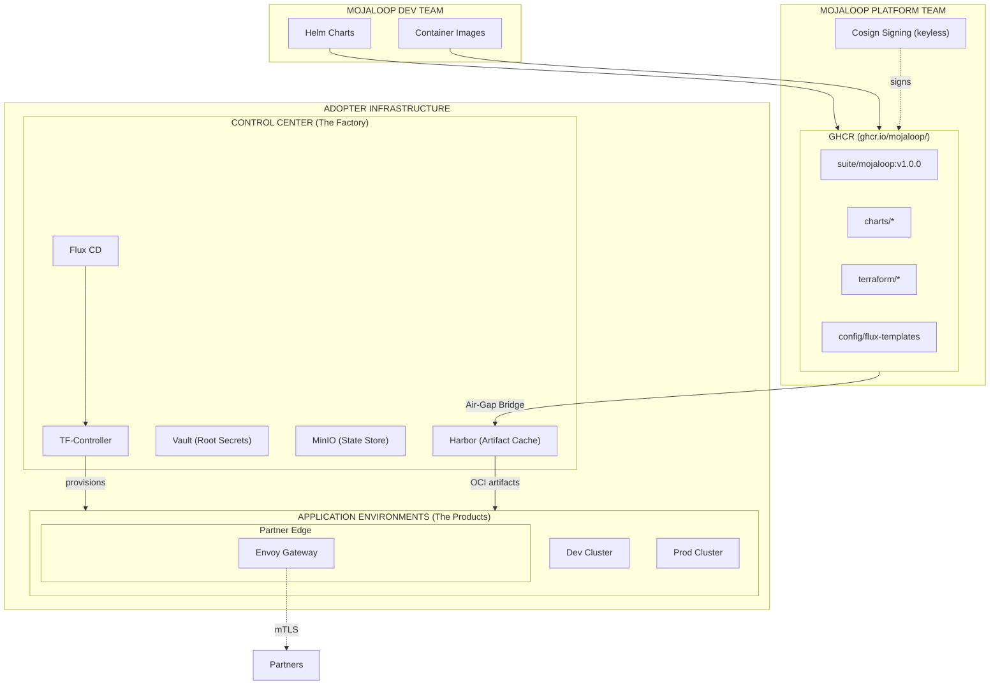

# Deployment Architecture V3: Gitless GitOps with Factory Model

## Table of Contents

1. [Executive Summary](#1-executive-summary)
2. [Architecture Overview](#2-architecture-overview)
3. [Roles and Responsibilities](#3-roles-and-responsibilities)
4. [Artifact Lifecycle](#4-artifact-lifecycle)
5. [Component Deep Dive](#5-component-deep-dive)
6. [Day 0: The Bootstrap Paradox & Pivot](#6-day-0-the-bootstrap-paradox--pivot)
7. [Day 1: Configuration Updates](#7-day-1-configuration-updates)
8. [Day 2: Application Upgrades](#8-day-2-application-upgrades)
9. [Technical Reference](#9-technical-reference)
10. [Disaster Recovery & Business Continuity](#10-disaster-recovery--business-continuity)
11. [Security Model](#11-security-model)
12. [Glossary](#12-glossary)

---

## 1. Executive Summary

### 1.1 What is this document?

This document describes the **Deployment Architecture V3** for delivering and managing the application across multiple adopter environments. It evolves the "Gitless GitOps" model by explicitly addressing the operational realities of air-gapped environments, secure secret bootstrapping, and complex B2B connectivity.

### 1.2 Why V3?

While V2 introduced the OCI-based distribution model, it lacked detail on:
1.  **The Bootstrap Paradox:** How to build the "Factory" (Control Center) when it is supposed to host its own state.
2.  **Partner Connectivity:** How to handle dynamic, complex mTLS for external partners (which standard CNI/Ingress cannot fully handle).
3.  **Air-Gap Reality:** The absolute need for a "Single Ingress Gate" for artifacts.

V3 refines the "Factory Model" to be robust enough for strictly regulated, air-gapped on-premise deployments while maintaining the ease of use of managed cloud services.

### 1.3 Key Benefits

| Benefit | Description |
|---------|-------------|
| **Air-Gap Native** | The Control Center acts as the single "Air-Lock" for all artifacts. Update once, deploy everywhere. |
| **Secure Chain of Trust** | Infrastructure secrets never leave the cluster boundary. The Control Center's Vault manages downstream keys. |
| **Dynamic Partner Edge** | Dedicated Envoy layer handles complex xDS-based mTLS updates without restarts. |
| **Atomic Versioning** | Each configuration state is an immutable, tagged artifact. Rollback is trivial. |

---

## 2. Architecture Overview

### 2.1 The "Factory Model" - Why it is Necessary

For simple cloud deployments, a "Factory" (Control Center) might seem like overhead. However, for **Financial Infrastructure** often running in air-gapped or hybrid environments, it is critical.

**Why we do NOT use direct Terraform per environment:**
1.  **Air-Gap Logistics:** Without a central registry cache, operators would need to manually carry artifacts (images, charts, TF modules) to *every* secure zone. The Control Center provides a single ingress point.
2.  **Secret Isolation:** We use a "Vault Chain." The Control Center Vault holds the keys to unseal the App Environment Vaults. Direct Terraform would require the operator's laptop to bridge these secure networks, creating a massive attack surface.
3.  **State Safety:** Storing Terraform state on an operator's laptop is a critical risk. The Control Center centralizes state management in a backed-up, highly available store.

### 2.2 Key Architectural Principles

1.  **The Cluster is Deaf to Git:** No cluster connects to Git. All clusters communicate only with OCI registries (Harbor).
2.  **OCI is the Universal Source of Truth:** Configuration is a versioned binary artifact.
3.  **The Pivot:** The Control Center is bootstrapped manually (Day 0), then "pivots" to become the automated manager for everything else (Day 1+).
4.  **Edge Specialization:** We use **Cilium** for internal networking (CNI, Network Policy) but **Envoy** for the Partner Edge (complex mTLS).

---

## 3. Roles and Responsibilities

(Teams remain largely unchanged from V2, with updates to Platform Team deliverables).

### 3.2 Mojaloop Platform Team

The Platform Team is responsible for packaging, signing, and releasing the **Mojaloop Suite**.

**Dependent Services Update:**

| Layer | Dependent Service | Purpose |
|-------|-------------------|---------|
| **Platform** | Vault | Secrets management, PKI, encryption |
| **Platform** | Cert-manager | TLS certificate automation |
| **Platform** | Cilium | Internal CNI, Network Policies, Service Mesh |
| **Edge** | **Envoy** | **Partner Connectivity, External mTLS, xDS Discovery** |
| **Platform** | OpenEBS | Storage provisioning |
| **Data Layer** | Operators | Kafka, MySQL, MongoDB, Redis management |

---

## 4. Artifact Lifecycle

(Unchanged from V2. The OCI distribution model remains the core strength).

---

## 5. Component Deep Dive

### 5.8 Partner Connectivity (Envoy)

While Cilium handles internal networking, the "Partner Edge" requires specialized handling for B2B financial protocols (mTLS with dynamic partner onboarding).

**The Challenge:**
- Partners are onboarded dynamically.
- Each partner has their own CA and specific TLS requirements.
- Restarting the ingress gateway to add a partner is unacceptable.

**The Solution:**
We deploy **Envoy** (either via `CiliumEnvoyConfig` or standalone) configured for **xDS (Discovery Service)**.
- **LDS (Listener Discovery):** Dynamic ports/listeners.
- **RDS (Route Discovery):** Dynamic routing tables.
- **CDS (Cluster Discovery):** Dynamic backend services.
- **SDS (Secret Discovery):** **Crucial.** Allows hot-swapping of certificates and validation contexts (Partner CAs) without connection drops.

---

## 6. Day 0: The Bootstrap Paradox & Pivot

This section addresses the "Inception" problem: How do you use the Control Center to build itself?

**Answer:** You don't. You build it manually, then hand over control.

### 6.1 Overview: The Bootstrap Phases

| Phase | Description | State Location | Connectivity |
|-------|-------------|----------------|--------------|
| **Phase 1: Manual Bootstrap** | Deploy generic Control Center via CLI | **Local** (Workstation/Secure USB) | Public/Air-Gap Bridge |
| **Phase 1.5: The Pivot** | (Optional) Migrate state to CC MinIO | **Remote** (CC MinIO) | Internal |
| **Phase 2: Customization** | Push Environment Inventory | Remote | Internal |
| **Phase 3: Automated Scaling** | CC builds App Environments | Remote | Internal |

### 6.2 Phase 1: Manual Bootstrap (The "Seed")

This phase is executed **once** from the Adopter's secure workstation.

**Prerequisites:**
- Secure Workstation ("Admin Console")
- `tofu`, `kubectl`, `talosctl`, `flux`
- Provider Credentials (e.g., Proxmox API Token)

**Steps:**
1.  **Configure:** Edit `config.yaml` with local provider settings.
2.  **Apply:** Run `tofu apply`.
    *   *Note:* The Terraform State is stored **LOCALLY** on the workstation (or a secure offline location).
3.  **Generate Recovery Kit:** The script outputs a `recovery-kit.json` containing:
    *   Vault Root Token
    *   Vault Unseal Keys
    *   Harbor Admin Password
    *   Control Center Kubeconfig

**CRITICAL SECURITY REQUIREMENT:** The `recovery-kit.json` and the local `terraform.tfstate` must be stored in a **Offline Secure Vault** (e.g., Physical Safe, Air-gapped Storage). If these are lost, the Control Center cannot be recovered or updated.

### 6.3 Phase 1.5: The Pivot (State Management)

Once the Control Center is running, it has its own MinIO instance. You have two choices for the CC's own state:

**Option A: True Air-Gap (Recommended for High Security)**
- Keep the CC's `terraform.tfstate` **OFFLINE** on the secure workstation.
- Only mount/access it when upgrading the Control Center itself.
- **Pros:** Maximum security. If CC is compromised, its infrastructure definition is safe.
- **Cons:** Operational friction for CC upgrades.

**Option B: Self-Hosted (Convenience)**
- Migrate the local state to the newly created CC MinIO.
- `tofu init -migrate-state`
- **Pros:** Any admin with credentials can update the CC.
- **Cons:** Circular dependency risk during disaster recovery.

### 6.4 Phase 2 & 3: Automated Scaling

Once the CC is up, the standard V2 workflow applies:
1.  Adopter pushes `env-config` artifact to Harbor.
2.  CC Flux detects change.
3.  TF-Controller (running in CC) provisions App Environments using state stored in CC MinIO.

---

## 7. Day 1: Configuration Updates

(Unchanged from V2)

---

## 8. Day 2: Application Upgrades

(Unchanged from V2)

---

## 9. Technical Reference

(Unchanged from V2)

---

## 10. Disaster Recovery & Business Continuity

### 10.3 Backup Strategy

**Updated for V3:**

| Component | Backup Location | Criticality |
|-----------|-----------------|-------------|
| **Recovery Kit (Keys/Config)** | **Offline Physical Safe** | **EXTREME** |
| **CC Terraform State** | Offline Safe OR CC MinIO | High |
| **App Env State** | CC MinIO | High |
| **Vault Data** | CC MinIO + External Replica | High |

### 10.4 Recovery Procedures

**Scenario: Total Loss of Control Center**

1.  **Retrieve Recovery Kit:** Get `recovery-kit.json` and `terraform.tfstate` from offline storage.
2.  **Restore Hardware:** Ensure physical/virtual resources are available.
3.  **Re-Run Bootstrap:** Use the saved `terraform.tfstate` to `tofu apply` (repair/recreate mode).
4.  **Restore Data:** Restore MinIO buckets (Harbor artifacts, Vault data) from external backups.
5.  **Unseal Vault:** Use keys from Recovery Kit.
6.  **Reconcile:** Flux will see the restored artifacts and reconnect to existing App Environments.

---

## 11. Security Model

### 11.4 The Vault Chain of Trust

V3 relies on a hierarchical Vault architecture to maintain isolation:

1.  **Root Vault (Control Center):**
    *   Stores Provider Credentials (AWS Keys, Proxmox Tokens).
    *   Stores "Unseal Keys" for downstream App Environment Vaults.
    *   **Never** accessed by App Environments directly.
2.  **Leaf Vault (App Environment):**
    *   Stores Runtime Secrets (DB Passwords, Certificates).
    *   Auto-unsealed by Root Vault during bootstrapping (transit auto-unseal).
    *   Accessible by workloads in that specific environment only.

This ensures that compromising a "Dev" environment does not compromise the "Root" credentials or other environments.

---
