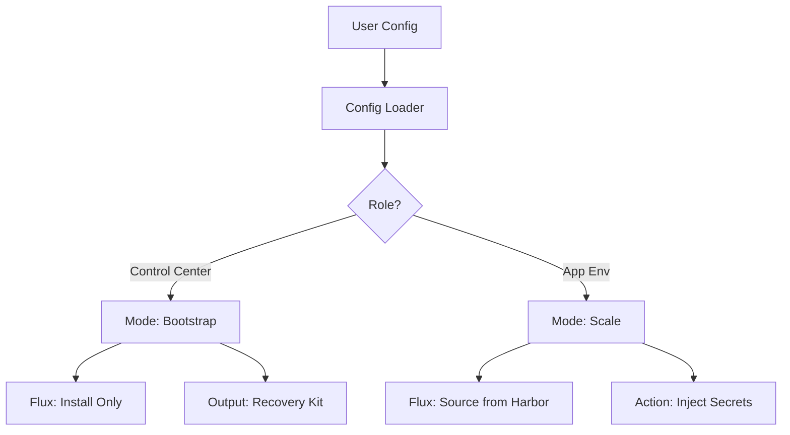

# Mojaloop V3 Developer Guide: The Migration Manual

This guide is designed for developers transitioning from the Legacy (V2) Git-centric architecture to the V3 "Gitless Factory" model. It maps the old structure to the new one and explains the "Unified Engine" concept.

## 1. Legacy vs. V3 Structure Map

### Where did `legacy/ml-iac` go?

The legacy codebase was a mix of Application Configuration (huge YAMLs) and Infrastructure Logic (complex mappings). V3 separates these strictly.

| Component | Legacy Location | V3 Location | Rationale |
|-----------|-----------------|-------------|-----------|
| **User Config** | `src/configs/*.yaml` | `config/config.yaml` | Single source of truth. No split files. |
| **Secrets** | `src/config/.env` | `config/.env` | Standardized environment variable injection. |
| **Cluster Logic** | `src/main.tf` + `src/modules/*` | `terraform/modules/cluster/` | Unified abstraction layer. |
| **Provider Logic** | `src/modules/proxmox-vm/` | `terraform/modules/providers/proxmox/` | Simplified, HA-aware implementation. |
| **Flux Bootstrap** | `src/modules/fluxcd-bootstrap/` | `terraform/modules/bootstrap/` | OCI-native bootstrap (no Git required). |
| **Generated Keys** | `artifacts/` | `recovery-kit/` | Explicit security boundary (GitIgnored). |
| **App Config** | `clusters/sw/apps/*/values.yaml` | **Flux Helm Values** | Managed by Flux (Day 2), not Terraform. |

---

## 2. The "Unified Engine" Concept

In V3, we do **not** have separate Terraform code for the Control Center (CC) and Application Environments (App Envs). We use a single codebase (`terraform/`) that behaves differently based on the **Role** defined in `config.yaml`.

### The Logic Flow



### Key Modules

#### 1. `config-loader` (`terraform/modules/config-loader`)
*   **Purpose:** Reads `config.yaml`, injects environment variables (secrets), and merges with `defaults.yaml`.
*   **Output:** A normalized JSON object `loaded_config`.

#### 2. `cluster` (`terraform/modules/cluster`)
*   **Purpose:** The Abstract Interface. It takes the `loaded_config` and decides *which* provider module to call.
*   **Responsibility:** It doesn't know about Proxmox APIs. It just knows "I need 3 Control Plane nodes".

#### 3. `providers/proxmox` (`terraform/modules/providers/proxmox`)
*   **Purpose:** The Concrete Implementation.
*   **V3 Improvement:** Replaces abstract "Zone/Region" mappings with direct "Physical Host" mapping (`node_1` -> `pve-01`) for simpler High Availability.

---

## 3. Configuration Schema (`config.yaml`)

The V3 configuration is designed to be flat and readable.

### 1. Infrastructure (`infra`)
Defines the physical layer.
*   `provider`: "proxmox" | "aws"
*   `proxmox.endpoint`: API URL.
*   `proxmox.nodes`: **CRITICAL**. Maps the abstract logical nodes to physical server names for Anti-Affinity.

### 2. Topology (`template`)
Defines the cluster shape.
*   `ha-small`: 3 Control Plane + 3 Workers (Production standard).
*   `tiny`: 1 Node (Dev/Test only).

### 3. Cluster (`cluster`)
Defines the Kubernetes layer.
*   `vip`: The Floating IP for the API Server.
*   `flux.mode`:
    *   `none`: For CC Day 0. Installs Flux binaries but waits for manual `flux push`.
    *   `oci`: For App Envs. Configures Flux to pull from the CC Harbor.

---

## 4. Developer Workflow

### Prerequisites
*   `tofu` (OpenTofu) or `terraform` >= 1.5
*   `kubectl`
*   `talosctl`
*   A Proxmox environment (VPN or Local)

### Step 1: Configuration
Copy the sample config and `.env`:
```bash
cp config/config.yaml.sample config/config.yaml
cp config/.env.sample config/.env
# Edit .env with your real credentials
```

### Step 2: Bootstrap (Day 0)
Run the helper script which sets up the environment and runs Terraform:
```bash
./scripts/bootstrap.sh
```

### Step 3: Access
If successful, the `recovery-kit/` directory will contain:
*   `admin.kubeconfig`: Access the cluster.
*   `talosconfig`: Access the nodes.
*   `recovery-kit.json`: Vault keys and Harbor passwords.

```bash
export KUBECONFIG=$(pwd)/recovery-kit/admin.kubeconfig
kubectl get nodes
```

---

## 5. Migration Checklist (Legacy -> V3)

- [ ] **Config:** Convert `deployment-templates.yaml` logic into the `proxmox.nodes` map in `config.yaml`.
- [ ] **Secrets:** Move all local secrets to `.env` variables.
- [ ] **State:** Ensure `recovery-kit/` is strictly ignored by `.gitignore`.
- [ ] **Flux:** Verify Flux installs without trying to clone a Git repo (V3 Requirement).
