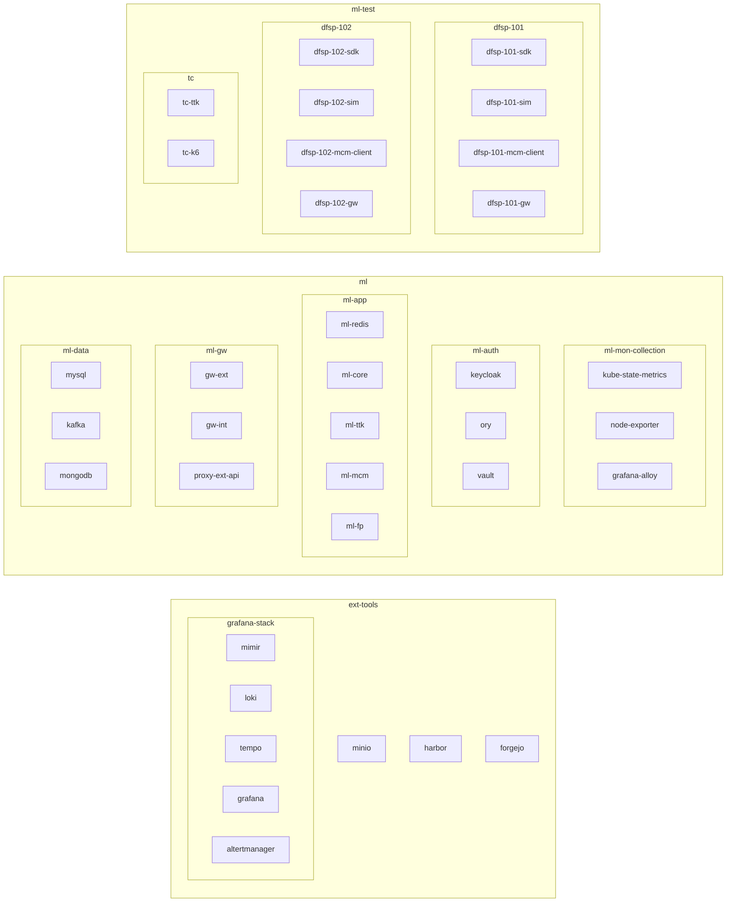

```mermaid
graph LR

    subgraph ext-tools
        minio
        harbor
        forgejo
        subgraph grafana-stack
            mimir
            loki
            tempo
            grafana
            altertmanager
        end
    end

    subgraph ml
        subgraph ml-mon-collection
            kube-state-metrics
            node-exporter
            grafana-alloy
        end

        subgraph ml-auth
            keycloak
            ory
            vault
        end

        subgraph  ml-app
            ml-redis
            ml-core
            ml-ttk
            ml-mcm
            ml-fp
        end

        subgraph ml-gw
            gw-ext
            gw-int
            proxy-ext-api
        end
        subgraph ml-data
            mysql
            kafka
            mongodb
        end
    end

    subgraph ml-test
        subgraph dfsp-101
            dfsp-101-sdk
            dfsp-101-sim
            dfsp-101-mcm-client
            dfsp-101-gw
        end
        subgraph dfsp-102
            dfsp-102-sdk
            dfsp-102-sim
            dfsp-102-mcm-client
            dfsp-102-gw
        end
        subgraph tc
            tc-ttk
            tc-k6
        end
    end
```